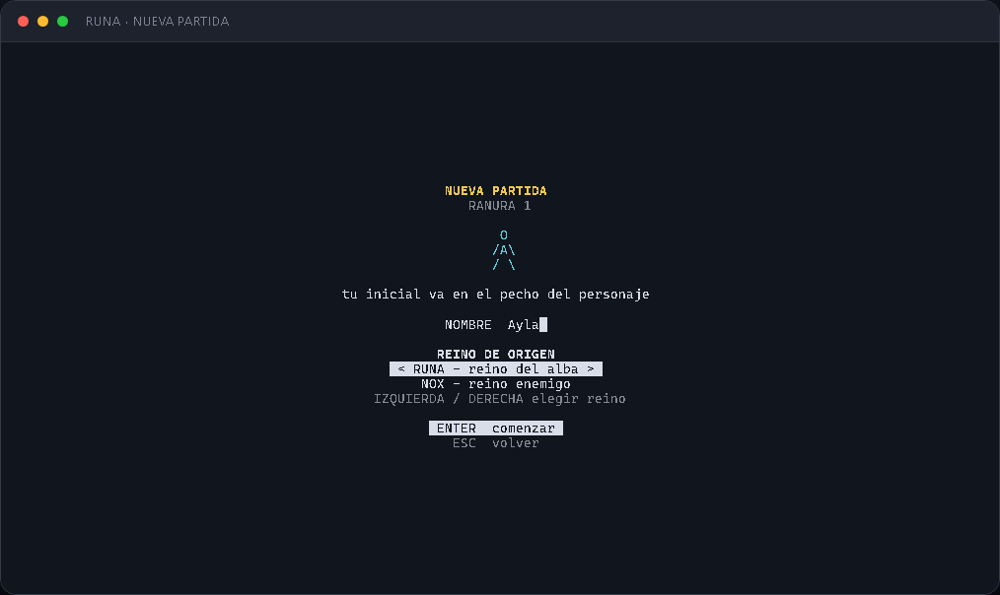
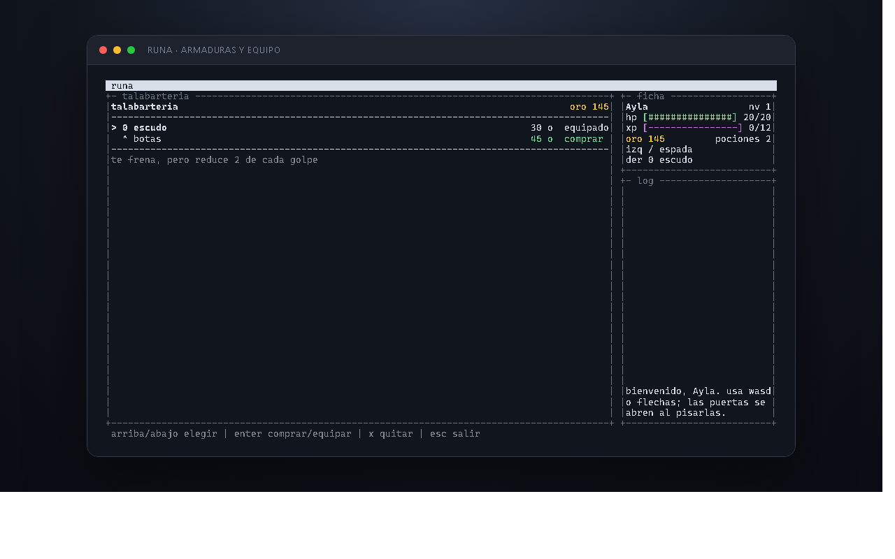

# RUNA

Un RPG ASCII para terminal donde exploras una ciudad, recorres la pradera y escribes las reglas que usa tu personaje al combatir.

El mundo corre sobre **Bare**, se dibuja con **bare-tui** y mantiene todo el arte dentro de una grilla ASCII estable. El personaje, los NPC y los monstruos se mueven sin borrar el terreno ni romper las líneas de la consola.


## Características actuales

- Ciudad de `320x200` caracteres con barrios, iglesia, taberna, herrería, armería y un castillo explorable.
- Dos reinos rivales, RUNA y NOX, con elección de origen y una frontera transitable en ambos sentidos.
- Salón del trono con rey, mobiliario real y una escalera propia hacia las ruinas.
- Portón funcional que transporta al jugador a la pradera.
- Pradera ampliada con una cripta de tres niveles y un portal al world boss.
- Arena volcánica independiente con lava, ruinas y el Coloso Rúnico.
- NPC con arte y oficios diferenciados.
- Monstruos que patrullan el mapa sin detener el movimiento del mundo.
- Combate sobre la propia pradera, sin cambiar a una pantalla separada.
- Nueva partida con nombre personalizado e inicial visible en el pecho del héroe.
- Tres ranuras persistentes con carga y autoguardado de progreso.
- Inventario y equipamiento separados, con ranuras para arma y armadura.
- Estrategias de combate escritas en `script.txt` y recargadas mientras juegas.
- Presencia opcional entre jugadores mediante Hyperswarm.
- Estatua de los héroes en la plaza con rankings por nivel y resultados PvP.
- Caballero de misiones en la plaza con objetivos persistentes y recompensas.

## Nueva partida y personaje

El menú principal separa claramente `Continuar`, `Nueva partida`, `Cargar partida` y `Salir`. `Continuar` abre la partida más reciente; `Nueva partida` usa la primera ranura vacía y `Cargar partida` abre el selector de tres ranuras. Si las tres están ocupadas, `N` permite elegir cuál reemplazar y la pantalla de nombre avisa qué personaje será sustituido.

La creación permite elegir con izquierda/derecha si el personaje nace en RUNA o en el reino enemigo de NOX. Cada origen tiene su propio punto de inicio y templo de reaparición. La frontera oriental de RUNA conecta con la frontera occidental de NOX, y se puede cruzar caminando en ambos sentidos.

El juego autoguarda después de cada acción y al salir. Conserva nombre, reino natal, nivel, vida, oro, experiencia, pociones, inventario, equipo y posición en la ciudad, NOX, el castillo, las ruinas, la pradera, la cripta o la arena volcánica. También conserva el progreso de la mazmorra y la vida del world boss. La ranura activa aparece en el pie de la pantalla como `autoguardado R1`, `R2` o `R3`.

La primera letra alfanumérica se convierte en el emblema del pecho. Por ejemplo, **Ayla** aparece como `A`:



El personaje comienza sin armas ni escudo. Su dibujo cambia únicamente cuando equipa un objeto real:

```text
sin equipo       espada          espada + escudo

    O            / O             / O
   /A\           /|A\            /|A\ [#]
   / \            / \             / \
```

## La ciudad

La ciudad usa una cámara desplazable para mantener edificios grandes y detallados sin reducir al jugador. Cada fachada tiene su propio diseño: la iglesia no comparte el arte de la taberna, la herrería o la armería. La plaza de los héroes incorpora una fuente monumental alrededor de la estatua, jardines, bancos y estandartes; sus chorros y ondas se animan con el reloj del mundo sin alterar las colisiones.


Las puertas se activan al pisarlas. El gran portón del sur conecta con la pradera y la puerta principal del castillo abre el salón del trono. Dentro espera el rey Aldren sentado en su trono, rodeado por una tarima real, columnas, estandartes, bancos y braseros. La escalera lateral `V` baja desde allí a las ruinas.

## La pradera

La pradera combina caminos, vegetación, agua y zonas de distinta dificultad. Mosquitos, espectros y gólems tienen sprites compactos y se mueven por su cuenta. En el sudeste, la entrada `X` abre una cripta de tres niveles; en el nordeste del yermo, el portal `O` lleva a las ruinas volcánicas del Coloso Rúnico.

La arena del world boss es un mapa independiente de ceniza, edificios destruidos y ríos de lava. La lava bloquea el paso: hay que cruzar por los puentes de piedra y conservar espacio para esquivar los poderes del Coloso. El mismo portal `O` permite volver al yermo.


Los espacios internos de todos los sprites son transparentes: el pasto y los caminos siguen visibles entre brazos, piernas y equipo.

Sir Cedric espera junto a la estatua de la plaza. Al hablarle con `E` entrega la misión de eliminar `20` mosquitos. Cada baja real actualiza el contador de la ficha y, al regresar con el objetivo completo, concede `100` de oro y `100` de experiencia. La recompensa solo puede cobrarse una vez y el progreso se conserva en la ranura activa.

## Combate dentro del mapa

El combate empieza cuando la hitbox del jugador toca la de un monstruo. Los dos personajes permanecen visibles sobre el terreno.


Cada pulsación de `F`, `Espacio` o una dirección contra el enemigo resuelve un intercambio. La estrategia decide qué arma usar; la tecla solamente hace avanzar el turno visible.

El archivo `script.txt` se vuelve a leer durante el combate:

```text
?hp < 8
 use potion
:?foe.dist >= 5
 equip crossbow
:
 equip sword
```

Una estrategia solo puede equipar objetos que el jugador realmente posee.

## Armas, armaduras y tiendas

Inventario y equipo no son lo mismo. Podés llevar **dos piezas equipadas al mismo tiempo**: un arma y una armadura. Comprar un objeto lo añade al inventario y lo equipa automáticamente en su ranura sin quitar la pieza de la otra ranura:

| Ranura   | Objetos                                             | Efecto                               |
| -------- | --------------------------------------------------- | ------------------------------------ |
| Arma     | daga, espada, lanza, ballesta, martillo, arco largo | Ataque, alcance y velocidad de golpe |
| Armadura | cuero, escudo, botas, cota de malla, placas         | Defensa o velocidad de movimiento    |



En una tienda:

- `Enter` compra o equipa el objeto seleccionado.
- `X` lo quita sin venderlo ni eliminarlo del inventario.
- `Esc` o `E` vuelve a la ciudad.

El escudo solo aparece junto al personaje cuando está equipado y reduce en `2` el daño de cada golpe, con un daño mínimo de `1`.

La daga y el cuero liviano cuestan `15` de oro cada uno, así que una partida nueva puede probar inmediatamente las dos ranuras con sus `30` de oro iniciales. Las piezas posteriores intercambian alcance, daño, defensa y velocidad; no son mejoras lineales.

## Controles

| Contexto         | Teclas                        | Acción                              |
| ---------------- | ----------------------------- | ----------------------------------- |
| Menú principal   | flechas / `W` / `S`           | Elegir una opción                   |
| Menú principal   | `Enter` / `Espacio`           | Aceptar la opción                   |
| Menú principal   | `N`                           | Comenzar una partida nueva          |
| Ranuras          | flechas / `W` / `S`           | Elegir una ranura                   |
| Ranuras          | `Enter`, `N`, `Esc`           | Cargar, reemplazar o volver         |
| Nombre y reino   | escribir, ←/→, `Enter`, `Esc` | Editar, elegir origen o volver      |
| Ciudad y pradera | `WASD` / flechas              | Moverse                             |
| Mundo            | `E` / `Enter` / `Espacio`     | Hablar o interactuar                |
| Jugador cercano  | `E`                           | Enviar un desafío PvP               |
| Estatua central  | `E`                           | Abrir rankings de nivel y PvP       |
| Rankings         | izquierda/derecha / `Tab`     | Cambiar clasificación               |
| Invitación PvP   | `Enter` / `N`                 | Aceptar o rechazar                  |
| Coliseo PvP      | `WASD`, `F`, `R`              | Moverse, atacar o rendirse          |
| Ciudad           | `V`                           | Abrir Wallet y PvP                  |
| Wallet           | `A` / `Enter`, `X`, `Esc`     | Vincular, desvincular o volver      |
| Pradera          | `T`                           | Volver a la ciudad fuera de combate |
| Combate          | `F` / `Espacio` / `Enter`     | Resolver un intercambio             |
| Tienda           | flechas, `Enter`, `X`, `Esc`  | Elegir, equipar, quitar o salir     |
| Juego            | `R`                           | Recargar `script.txt`               |
| Juego            | `?`                           | Mostrar dónde está el script        |
| Juego            | `Q` / `Ctrl+C`                | Salir                               |

La terminal mínima es de **64x16**. Para apreciar el mapa y la ficha lateral se recomienda **120x34** o más.

La pantalla de wallet acepta únicamente una dirección pública Stellar `G...` y
la guarda con la ranura. No acepta ni almacena seeds secretas `S...`. Vincular
una dirección identifica al jugador, pero las apuestas on-chain seguirán
marcadas como pendientes hasta configurar el contrato desplegado y un firmante
externo. Consulta [docs/wallet.md](docs/wallet.md).

## Ejecutar desde el repositorio

Requiere Node.js y npm para instalar las dependencias. El juego se ejecuta con el runtime Bare incluido en el proyecto.

```bash
git clone https://github.com/leocagli/runa.git
cd runa
npm install
npm start -- --solo
```

Para habilitar la presencia entre jugadores, inicia sin `--solo`:

```bash
npm start
```

También puedes elegir un nombre inicial desde la línea de comandos; aparecerá precargado en la pantalla de nueva partida:

```bash
npm start -- --solo --name Ayla
```

## Pruebas y revisión

```bash
npm test
npm run lint
npx bare test/map.smoke.js
```

Estado revisado de esta versión:

- `127/127` pruebas correctas.
- `1039/1039` aserciones correctas.
- Formato y lint limpios.
- RUNA, NOX, fronteras, puertas, portón, pradera y dungeon validados por el smoke test.
- Capturas inspeccionadas y recortadas al borde exacto de la terminal.

## Capturas reproducibles

Las imágenes de este README no son maquetas escritas a mano. El script [scripts/readme-screens.js](scripts/readme-screens.js) construye cada estado usando `Runa`, `Field` y el render real del juego, y genera HTML con los colores ANSI listo para capturar.

```bash
npx bare scripts/readme-screens.js .readme-screens
```

Esto evita documentar una ciudad, un héroe o un combate que ya no coincidan con el código.

## Arquitectura

| Archivo                        | Responsabilidad                                       |
| ------------------------------ | ----------------------------------------------------- |
| `lib/game.js`                  | Menús, entrada, transiciones y coordinación general   |
| `lib/map.js`                   | Ciudad, castillo, colisiones, puertas y NPC           |
| `lib/field.js`                 | Pradera, cámara, patrullaje y encuentros              |
| `lib/dungeon.js`               | Tres niveles de mazmorra, rutas y encuentros          |
| `lib/boss-zone.js`             | Ruinas volcánicas y combate del world boss            |
| `lib/world.js`                 | Simulación de combate y estadísticas derivadas        |
| `lib/shop.js`                  | Economía, inventario, equipo, guardados y migraciones |
| `lib/saves.js`                 | Tres ranuras, archivos persistentes y carga segura    |
| `lib/render.js`                | Composición estable de cada cuadro de terminal        |
| `lib/sprites.js`               | Arte ASCII del héroe, NPC y referencias maestras      |
| `lib/synchronized-renderer.js` | Publicación atómica de cuadros en Windows Terminal    |

Los enemigos, objetos, tiendas y mapas son datos. Esto permite ampliar el contenido sin duplicar lógica de combate o de renderizado.

## Bare, Pear y distribución P2P

- **Bare** ejecuta el juego y sus pruebas sin depender de las APIs internas de Node.
- **bare-tui** proporciona el ciclo de actualización, teclado y render de terminal.
- **Pear** permite distribuir builds y actualizaciones entre pares.
- **Hyperswarm** ofrece presencia opcional sin convertir el estado del jugador en una dependencia de red.

La partida funciona completamente en modo solitario cuando la red no está disponible.

## Referencias de arte ASCII

Los diseños compactos fueron adaptados a la escala del mapa a partir de referencias ASCII clásicas. El caballero maestro conserva la firma `hjw` en el código.

- [Colección de caballeros ASCII](https://ascii.genocation.com/ascii/caballeros.html)
- [Colección general de arte ASCII](https://ascii.genocation.com/ascii/coleccion.html)

El interior de la cripta parte de fuentes arquitectónicas y criterios de
exploración documentados en [docs/dungeon-design.md](docs/dungeon-design.md).

## Licencia

Apache-2.0.
