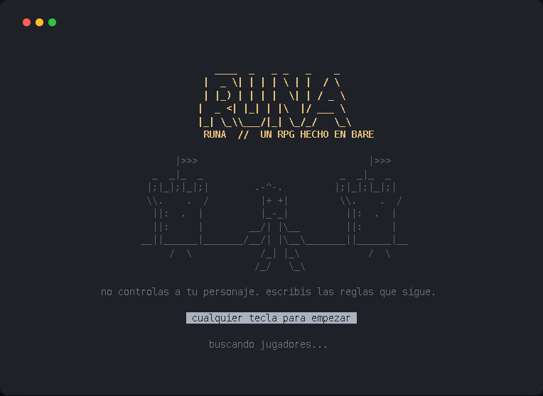
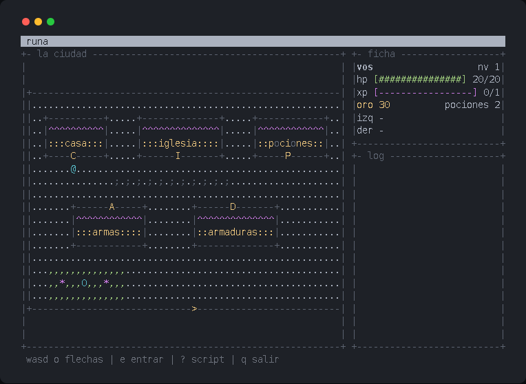
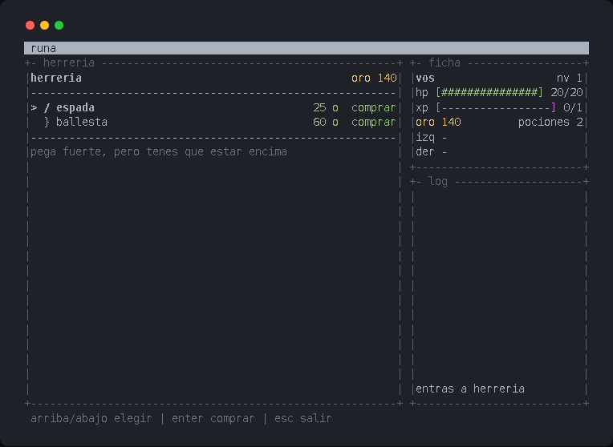
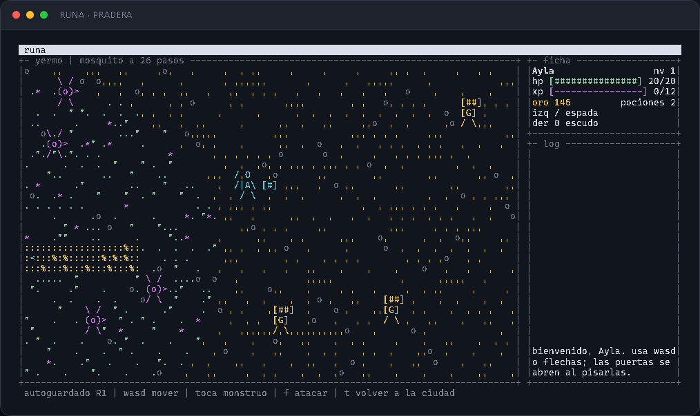
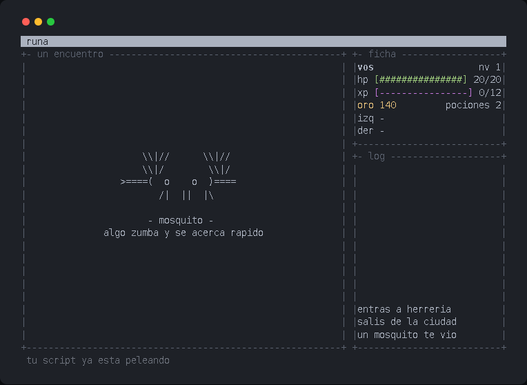
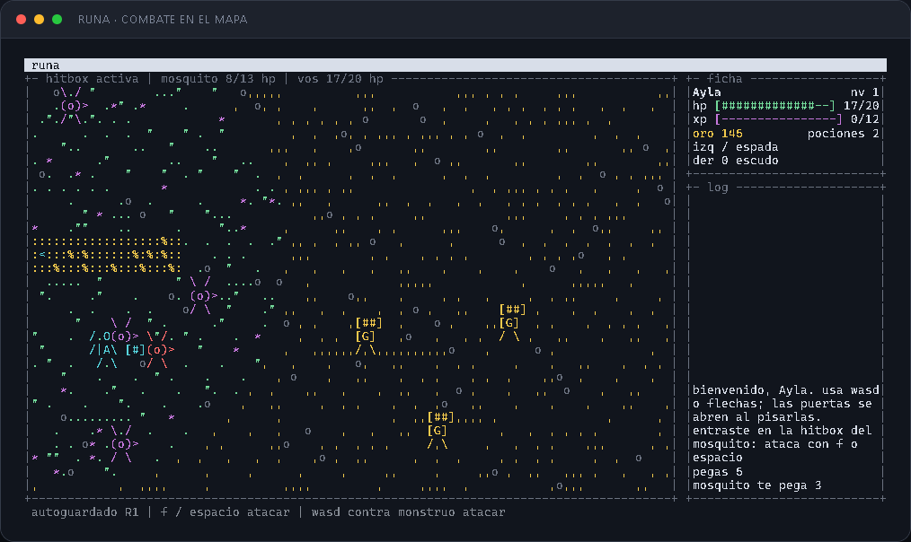

# Runa

**An MMORPG where you never touch the controls. You write the rules your character fights by, and they run without you.**

Single player is what ships today, and every piece of the shared world has its state written down below, measured rather than promised.

Built for the [Aleph Hackathon 2026](https://hacki.crecimiento.build/h/aleph-hackathon-2026), Pears track.



## What this does with Pear and Bare

This is not a game that happens to be distributed with Pear. The platform is doing four specific jobs, and the game is shaped around them.

|                                            |                                                                                                                                                                                                                                                                                     |
| ------------------------------------------ | ----------------------------------------------------------------------------------------------------------------------------------------------------------------------------------------------------------------------------------------------------------------------------------- |
| **Bare is the runtime**                    | The whole game runs on Bare, not Node. No built-in modules, no `process` global, no `fs`. Everything goes through the `bare-*` packages, and the UI is `bare-tui`, the same Elm-architecture framework the Pear CLI itself runs on.                                                 |
| **One binary, four platforms**             | `bare-build --standalone` compiles the game and the runtime into a single executable. All four were cross-compiled from one Linux machine and checked with `file`: Mach-O for both Macs, PE32+ for Windows, ELF for Linux. Your users need no Node, no Bare, not even the Pear CLI. |
| **Pear is the distribution**               | `pear install pear://<key>` and you are playing. No package manager, no app store, no download page, no server paying for bandwidth. The binary arrives from whoever already has it.                                                                                                |
| **Content is data, so the world can grow** | Enemies, items, prices and the town map are plain objects, not code. A new monster is a few lines of data rather than a new build, which is what makes shipping one over the air possible at all.                                                                                   |

## Run it from this repo

If you are reading this on GitHub, this is the path you want. It needs Node and
npm and nothing else. `npm install` pulls the Bare runtime in as a dependency, so
there is no Bare and no Pear CLI to install first.

```bash
git clone https://github.com/leocagli/runa.git
cd runa
npm install
npm start
```

Any key gets you past the title. Then:

| Key                     | What it does                               |
| ----------------------- | ------------------------------------------ |
| arrows or `wasd`        | walk                                       |
| `e`, `enter` or `space` | go through the door you are standing on    |
| `<`                     | leave the field and go back to town        |
| `r`                     | reload your rules while a fight is running |
| `q` or `Ctrl+C`         | quit                                       |

The game takes the whole terminal, so it wants at least **64 by 16**. Below that
it prints the size it needs instead of drawing a broken frame.

Everything else is worth running too:

```bash
npm test    # the model, headless: town, shops, field, combat, the language
npm run make    # cross compile a standalone binary for this machine
```

## Or install it with no clone at all

Same game, handed over peer to peer as one executable. Nothing on the receiving
machine: no Node, no Bare, not even the Pear CLI.

```bash
pear install pear://hg11t8ipq5kkc7d4prdmu4mapi18yqm7p43ee5dzmnf7y1yjyo9o
runa
```

**Binaries built for:** `linux-x64`, `darwin-arm64`, `darwin-x64`, `win32-x64`.

## What it looks like

Real screenshots of the game running, not text pasted into a code block.

### The town

You walk this yourself, with WASD or the arrows. Capital letters are doors: `C` your house, `I` the church, `A` the smithy, `P` the apothecary, `D` the armoury, and `>` the gate out to the field. Lowercase letters are the painted shop signs, and they are solid: you cannot walk through a wall just because somebody wrote a name on it.



### A shop

The two weapons are deliberately far apart. A sword twenty percent better than a crossbow would make a wrong rule cost you a slightly longer fight, and you would never notice your script was wrong. The gap has to be wide enough that a bad rule loses on screen.



### The field

Monsters wander on their own clock. Walking is free, in the Pokemon sense: a step is not a turn, and the world ticks fifteen times a second whether you move or not.



### Meeting something

A creature used to start existing as one character on a line. That is enough to fight it and not enough to remember it, so it gets a card of its own for about two seconds.

It is not a pause. The fight is already running underneath and your rules are already working; this is a look at what they are working against. A monster that arrives over the air without a portrait falls back to a question mark, which reads as "something new" rather than as a bug.



### The fight, which you do not play

Here the keyboard stops mattering. What fights is the rule sheet you wrote.



**Everything on that screen is a number your rules can read.** That is the whole design: the interface shows exactly the state the language exposes, so watching a fight and debugging a rule are the same activity.

| On screen                    | In your rules  | What it decides                 |
| ---------------------------- | -------------- | ------------------------------- |
| The two fighters on the line | `foe.dist`     | Whether you can reach it at all |
| The dotted stretch           | `reach`        | How far your weapon hits from   |
| `golpe [####] listo`         | `ready`        | Whether you can swing this tick |
| The health bars              | `hp`, `foe.hp` | When to drink, when to run      |

The hero holds the range its weapon wants: it closes when too far and backs away when the foe gets inside it. That retreat is what makes reach mean anything. Without it a long weapon and a short one produce the same fight, and your choice of item never shows up on screen.

Sword against something fast and you die in three and a half seconds. Two lines that reach for the crossbow at range and you win with fifteen health left. Both numbers are measured, not estimated.

## We are building an MMORPG, and the hard part is already proven

The word MMORPG is doing real work in that first line, so here is exactly what backs it.

**An MMO is expensive because the server has to keep telling everyone what the world looks like.** Runa does not have that problem, and not by cleverness: by an accident of what the game is. Your character fights by a rule sheet you wrote, the simulation is a pure function of the starting state, that sheet and the tick count, and it is deterministic. Measured, not assumed: the same seed replayed twice over 2,500 ticks, through fights, potions, deaths and level ups, lands on the identical world.

So two machines do not have to be told what happened. They can both work it out.

| What travels            | Size                                      |
| ----------------------- | ----------------------------------------- |
| A frame of world state  | ~111 bytes, 15 times a second, per player |
| One minute of that      | ~98 KB per player                         |
| A rule sheet and a seed | **77 bytes, sent once**                   |

That is three orders of magnitude, and it is the whole thesis. Everything a normal MMO spends its budget on, this game gets to skip.

The second half is safety. The rule language has **no loops and no recursion**, so a script cannot run forever and cannot hang anyone's game. Running a stranger's rules at fifteen ticks a second is therefore not a risk to be managed, it is just something the language cannot do. Those two properties together are what make a shared world affordable here and unaffordable almost everywhere else.

**A server is what usually kills a project like this.** Someone has to pay for it, keep it up, and shut it down when the money runs out. There is no server here. When you run `pear install`, 98 MB moves from another player's machine to yours, with no host in the middle. When a new release ships, a running copy pulls it from its peers on its own. Both of those are measured above, not planned.

So the question stops being "who pays for the world" and becomes "who is right about it". That one is not solved, and the table says so.

| Piece                                         | State                                                                                 |
| --------------------------------------------- | ------------------------------------------------------------------------------------- |
| Find other players with no server             | **Working.** It is what `pear install` does: announce on the swarm, get found by key. |
| Move data between players                     | **Working.** 98 MB peer to peer, in seconds.                                          |
| Ship new content to a live world              | **Working.** A running copy went `0.0.0-rc.0` to `0.1.0` by itself.                   |
| Share the state of the world                  | Next. `Hyperbee` for the log, `Autobase` for many writers.                            |
| Decide who is right when two players disagree | The real work, and the honest hard part.                                              |

**What lands next, in order.** Strategies travel first: the language has no loops and no recursion, so a script cannot hang the game, and that is exactly the property that makes it safe to run a stranger's rules at 15 ticks a second. Sharing a rule sheet over Hyperswarm is a small change with a large consequence, because the moment one player can send another a strategy, the game has a community instead of an audience.

Then presence: seeing another `@` walk across your town. Then trade. Then a fight two people watch at once.

The far end is a world where the content and the players' strategies both travel peer to peer, nobody pays a hosting bill, and the thing keeps running as long as one person still has it installed. That last part is the reason to build it this way: **a peer-to-peer MMO cannot be shut down by its author running out of money**, which is how almost every small MMO has ever died.

## Over-the-air updates work, and the trap that hides it

An installed copy picks up a new release from its peers while it is running. Measured, not asserted:

|                            | Before             | After, with nothing touched |
| -------------------------- | ------------------ | --------------------------- |
| Version the binary reports | `runa v0.0.0-rc.0` | `runa v0.1.0`               |
| Storage                    | 572 KB             | 95 MB                       |

Nobody downloaded anything by hand. The running copy found the new release on the swarm, pulled 95 MB from peers and applied it.

**The trap, because it cost hours and the boilerplate walks you straight into it.** The updater does not compare drive length. It compares the semver in `package.json`, at `pear-runtime-updater/index.js:138`:

```js
const current = semver.Version.parse(this.version) // the installed package.json
const remote = semver.Version.parse(manifest.version) // the published one

if (!remote || current.compare(remote) >= 0) {
  this.checkout = null // decides there is nothing new
}
```

`hello-pear-bare` ships `"version": "0.0.0-rc.0"` and never tells you to change it. So you stage new content, the drive length climbs, the seeder serves it, the swarm connects, and the updater sits there silently deciding nothing happened, because `0.0.0-rc.0` compares equal to `0.0.0-rc.0` and equal satisfies `>= 0`.

**Publishing new content is not enough. Bump the version in `package.json` before you stage,** or the update will never fire and every other part of the pipeline will look healthy while it does not.

## Honest status

Verified by hand, against a real PTY rather than CI:

- `pear install` from a clean machine, then the game boots.
- Walking, collision, all six doors, buying, the church healing, the field, a fight resolving, gold and experience landing, levelling up.
- The measured balance: the naive script dies in 3.5 seconds, the fixed one wins with 15 health left.
- Cross-compilation to four platforms, checked with `file`.
- An OTA update landing on a running installed copy, above.

CI is green too, but CI never launched the app to see what it printed. For most of this weekend the binary installed fine and then ran the boilerplate's `Hello from worker` instead of the game, and every check stayed green through all of it. Launching the thing in a terminal is the only test that would have caught that.

## The idea

Every terminal RPG lets you press a key to swing a sword. This one does not.

You walk the town yourself, with the arrows or WASD. You go into the weapon shop, the armoury, the apothecary, the church. But the moment a fight starts, the keyboard stops mattering. What fights is a **rule sheet you wrote**, in a file, in your own editor, next to the game.

```
?hp < 8
 use potion
:?foe.dist >= 5
 equip crossbow
:
 equip sword
```

Equip the sword against something fast and you die in three and a half seconds. Add the two lines that reach for the crossbow at range and you win with fifteen health left. **The difficulty of this game is the quality of your reasoning**, and you can watch a bad rule lose in real time.

The file is re-read while the fight is running. Fix a rule mid-combat, save, and the character changes its mind on the next tick without anything restarting.

## The language

Borrowed in spirit from StoneScript in Stone Story RPG, which got the central idea right: **the whole script is re-evaluated every tick**, top to bottom. It is not a program that runs once, it is a rule sheet that gets consulted continuously.

That single decision removes the hard parts. There is no program counter to advance, no coroutines, no scheduler, no event queue. It also buys a safety property worth stating plainly: the language has **no loops and no recursion**, so a script cannot hang the game. That is what makes it safe to run a stranger's script every frame, which is what will let strategies travel between players.

| Symbol       | Meaning                                 |
| ------------ | --------------------------------------- |
| `?`          | if                                      |
| `:?`         | else if                                 |
| `:`          | else                                    |
| `!` `&` `\|` | not, and, or                            |
| `>`          | print, with `@hp@` interpolation        |
| indentation  | dependency. No braces, nothing to close |

Readable state: `hp`, `maxhp`, `potions`, `ready`, `left`, `right`, `foe.kind`, `foe.hp`, `foe.dist`, `foe.flying`.
Commands: `equip`, `equipL`, `equipR`, `use`, `wait`.

Three deliberate choices in the implementation:

- **Commands are collected, then applied.** The last rule that matched wins, which is how a person reads a sheet from top to bottom. Applying them as they are found would let an early rule spend the turn before a later, more specific one got to speak.
- **An unknown name fails the condition instead of throwing.** One typo does not take the script down mid-fight.
- **Tabs are rejected rather than guessed at.** A tab that renders as four in your editor and eight in mine silently changes which branch a line belongs to, and the player has no way to see it.

## Why Pear is the mechanic, not the delivery

Content is data, not code. Enemies, items, shops, prices and the town map itself are plain objects. So a new monster is not a new build, it is an over-the-air data update that a running copy picks up from peers.

That turns the track's hardest requirement into the most interesting thing in the game: **the world can change under a script that is already running**. You solved the mosquito with one rule; a patch lands, a golem walks in with a longer reach, and the rule that used to win now loses. You have to write another one.

## Playing

| Key              | Does                               |
| ---------------- | ---------------------------------- |
| `wasd` or arrows | walk                               |
| `e`              | enter the door you are standing on |
| `r`              | reload the script by hand          |
| `?`              | remind you where the script lives  |
| `q`              | quit                               |

Doors are the capital letters: `C` your house, `I` the church (free healing), `P` apothecary, `A` weapons, `D` armour, `>` the gate out to the field. Lowercase letters are the painted shop signs and are solid, so you cannot walk through a wall just because someone wrote a name on it.

Your script lives in `script.txt` next to the binary. It is created on first run.

## Built from

Started from [`holepunchto/hello-pear-bare`](https://github.com/holepunchto/hello-pear-bare), branch **`main`** (the updater in a Bare worker thread, which is the shape their docs recommend for long-lived TUIs).

- [`bare-tui`](https://github.com/holepunchto/bare-tui) for the interface, Elm architecture, zero dependencies. The Pear CLI itself runs on it.
- `pear-runtime` for the peer-to-peer OTA updater.
- `hyperswarm` for connectivity.
- Everything else is in this repo.

## Notes from building it

Pear and Bare are not Node, and the gap is not cosmetic. Things that cost real time and are written down here so they cost you less:

- **`pear run` no longer exists** in Pear 3.2.0. Some templates still reference it.
- **`pear install` serves binaries, not source.** Without `pear build` first it answers `Not found` for `by-arch/<platform>/app/<name>`.
- **`bare-build` cross-compiles.** All four platforms above were produced from one Linux machine, verified with `file`: Mach-O for the two Macs, PE32+ for Windows.
- **Bare has no built-in modules and no `process` global.** `require('fs')` fails; it is `bare-fs`. Same for `tty`, `path`, `process`.
- **`TextEncoder`, `TextDecoder`, `crypto` and `fetch` are not globals either.**
- **The `upgrade` field in `package.json` is mandatory.** The app will not start without a real link from `pear touch`.

## License

Apache-2.0.
