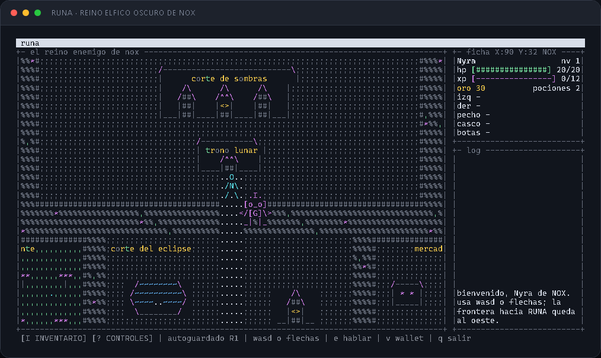
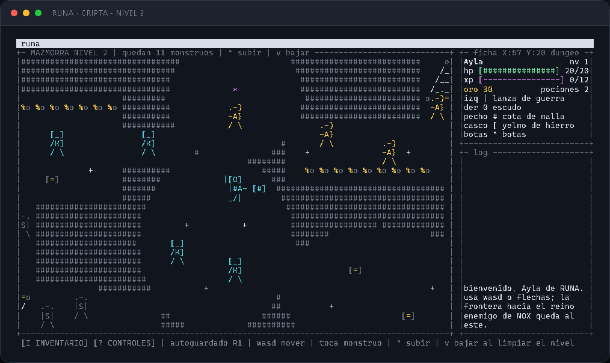
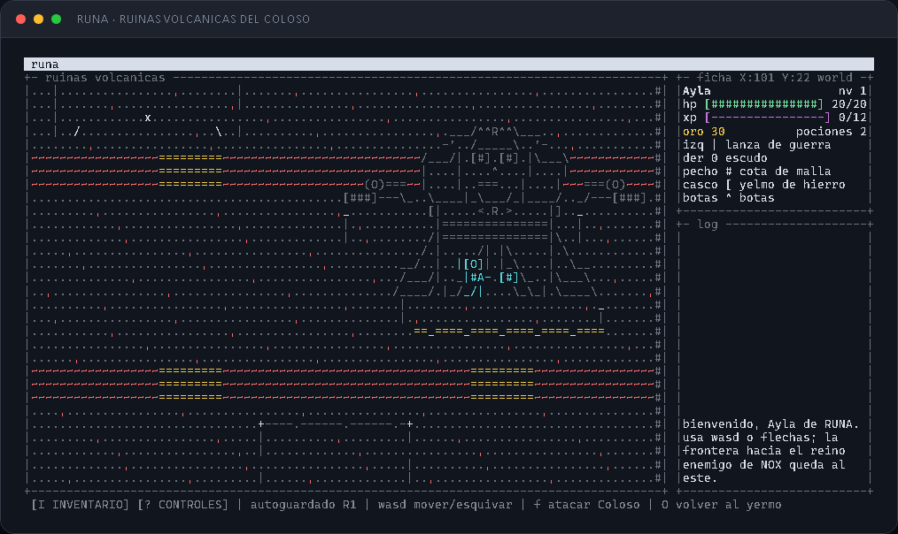
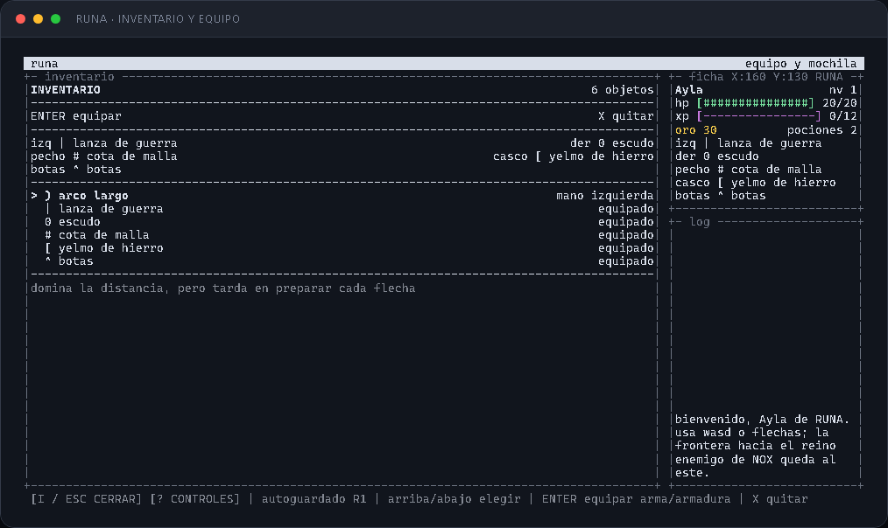

# RUNA

Un RPG ASCII para terminal donde exploras una ciudad, recorres la pradera y escribes las reglas que usa tu personaje al combatir.

**Versión actual: 0.2.0 — Reinos y exploración**

El mundo corre sobre **Bare**, se dibuja con **bare-tui** y mantiene todo el arte dentro de una grilla ASCII estable. El personaje, los NPC y los monstruos se mueven sin borrar el terreno ni romper las líneas de la consola.


## Novedades de la versión 0.2.0

- El mundo ahora une los reinos rivales de RUNA y NOX mediante portones completos en los extremos de la pradera; el reino natal se elige al crear el personaje.
- NOX fue reconstruido como una capital élfica oscura explorable, con Palacio del Eclipse, corte lunar, jardín bioluminiscente animado, Mercado Velado, servicios y habitantes propios.
- La nueva cripta tiene tres niveles consecutivos, escaleras ASCII, slimes, cuatro clases de esqueletos y un Rey Esqueleto final.
- El Coloso Rúnico fue reubicado en un mapa independiente de ruinas volcánicas, lava y puentes, al que se entra por un portal monumental del yermo.
- El inventario incorpora mano izquierda, mano derecha, pecho, casco y botas. Armas, escudo y armaduras pueden equiparse simultáneamente y guardarse en el cofre del hogar.
- La plaza suma estatua con rankings de nivel y PvP, caballero de misiones, fuente animada y controles desplegables.
- El combate conserva el arma elegida —lanza, arco, ballesta, daga o martillo— y la ficha muestra coordenadas `X/Y` para ubicar cualquier punto del mundo.









## Características actuales

- Ciudad de `320x200` caracteres con barrios, iglesia, taberna, herrería, armería y un castillo explorable.
- Dos reinos rivales, RUNA y NOX, con elección de origen y portones monumentales en extremos opuestos de la pradera.
- Salón del trono con rey, mobiliario real y una escalera propia hacia las ruinas.
- Portón funcional que transporta al jugador a la pradera.
- Pradera ampliada con una cripta de tres niveles, escalinatas ASCII monumentales y un portal al world boss.
- Arena volcánica independiente con lava, ruinas y el Coloso Rúnico.
- NPC con arte y oficios diferenciados.
- Monstruos que patrullan el mapa sin detener el movimiento del mundo.
- Combate sobre la propia pradera, sin cambiar a una pantalla separada.
- Nueva partida con nombre personalizado e inicial visible en el pecho del héroe.
- Tres ranuras persistentes con carga y autoguardado de progreso.
- Botón permanente `[I INVENTARIO]`, depósito en el hogar y cinco ranuras de equipo independientes.
- Botón `[? CONTROLES]` y ayuda desplegable disponible desde el menú o la partida.
- Estrategias de combate escritas en `script.txt` y recargadas mientras juegas.
- Presencia opcional entre jugadores mediante Hyperswarm.
- Estatua de los héroes en la plaza con rankings por nivel y resultados PvP.
- Caballero de misiones en la plaza con objetivos persistentes y recompensas.

## Nueva partida y personaje

El menú principal separa claramente `Continuar`, `Nueva partida`, `Cargar partida` y `Salir`. `Continuar` abre la partida más reciente; `Nueva partida` usa la primera ranura vacía y `Cargar partida` abre el selector de tres ranuras. Si las tres están ocupadas, `N` permite elegir cuál reemplazar y la pantalla de nombre avisa qué personaje será sustituido.

La creación permite elegir con izquierda/derecha si el personaje nace en RUNA o en el reino enemigo de NOX. Cada origen tiene su propio punto de inicio y templo de reaparición. La frontera oriental de RUNA conecta con la frontera occidental de NOX, y se puede cruzar caminando en ambos sentidos.

NOX es una capital élfica oscura excavada en una caverna volcánica. El Palacio del Eclipse, la corte lunar, un jardín de hongos bioluminiscentes, el Mercado Velado y los barrios de artesanos sustituyen la antigua explanada vacía. Seis habitantes propios explican su cultura y sus servicios; las dos avenidas principales mantienen todas las puertas y distritos conectados. Las decisiones visuales y sus [fuentes de inspiración están documentadas](docs/nox-design.md).

El juego autoguarda después de cada acción y al salir. Conserva nombre, reino natal, nivel, vida, oro, experiencia, pociones, inventario, equipo, depósito del hogar y posición en la ciudad, NOX, el castillo, las ruinas, la pradera, la cripta o la arena volcánica. También conserva el progreso de la mazmorra y la vida del world boss. La ranura activa aparece en el pie de la pantalla como `autoguardado R1`, `R2` o `R3`.

La primera letra alfanumérica se convierte en el emblema del pecho. Por ejemplo, **Ayla** aparece como `A`:


El personaje comienza sin armas ni escudo. Su dibujo cambia únicamente cuando equipa un objeto real:

```text
sin equipo       espada          espada + escudo

    O            / O             / O
   /A\           /|A\            /|A\ [#]
   / \            / \             / \
```

## La ciudad

La ciudad usa una cámara desplazable para mantener edificios grandes y detallados sin reducir al jugador. Cada fachada tiene su propio diseño: la iglesia no comparte el arte de la taberna, la herrería o la armería. La plaza de los héroes incorpora una fuente monumental alrededor de la estatua, jardines, bancos y estandartes; sus chorros y ondas se animan con el reloj del mundo sin alterar las colisiones.


Las puertas se activan al pisarlas. El gran portón del sur conecta con la pradera y la puerta principal del castillo abre el salón del trono. Dentro espera el rey Aldren sentado en su trono, rodeado por una tarima real, columnas, estandartes, bancos y braseros. La escalera lateral `V` baja desde allí a las ruinas.

## La pradera

La pradera combina caminos, vegetación, agua y zonas de distinta dificultad. Mosquitos, espectros y gólems tienen sprites compactos y se mueven por su cuenta. El borde oeste contiene el portón completo de RUNA, cuyo paso `<` vuelve a la ciudad; en la punta opuesta, contra el borde este, el portón oscuro `N` entra al reino de NOX. Ambos accesos tienen fachada, nombre y una zona despejada de monstruos. Lejos de esa frontera, la entrada `X` abre una cripta de tres niveles en el sur interior y el portal `O` espera en el norte-central del yermo para llevar a las ruinas volcánicas del Coloso Rúnico.

La ficha muestra siempre la posición actual como `X:n Y:n` junto al mapa o zona. Las coordenadas cambian con cada paso y distinguen RUNA, NOX, castillo, ruinas, coliseo, pradera, yermo, cada nivel del dungeon y el mapa del world boss. Podés usar esa referencia para señalar un lugar concreto al reportar un problema o pedir un cambio.

La arena del world boss es un mapa independiente de ceniza, edificios destruidos y ríos de lava. La lava bloquea el paso: hay que cruzar por los puentes de piedra y conservar espacio para esquivar los poderes del Coloso. El mismo portal `O` permite volver al yermo.


Los espacios internos de todos los sprites son transparentes: el pasto y los caminos siguen visibles entre brazos, piernas y equipo.

Sir Cedric espera junto a la estatua de la plaza. Al hablarle con `E` entrega la misión de eliminar `20` mosquitos. Cada baja real actualiza el contador de la ficha y, al regresar con el objetivo completo, concede `100` de oro y `100` de experiencia. La recompensa solo puede cobrarse una vez y el progreso se conserva en la ranura activa.

## Combate dentro del mapa

El combate empieza cuando la hitbox del jugador toca la de un monstruo. Los dos personajes permanecen visibles sobre el terreno.


Cada pulsación de `F`, `Espacio` o una dirección contra el enemigo resuelve un intercambio. El arma elegida en `I INVENTARIO` permanece en la mano durante el combate: lanza, arco, ballesta, daga y martillo conservan su daño, alcance, velocidad y dibujo propios al golpear. La tecla solamente hace avanzar el turno visible.

El archivo `script.txt` se vuelve a leer durante el combate:

```text
?hp < 8
 use potion
```

La estrategia inicial no cambia armas por su cuenta. Si querés una estrategia que alterne equipo durante la pelea, podés añadir reglas `equip`, pero solo se aplican a objetos que el jugador realmente posee; una orden inválida nunca reemplaza el arma equipada desde el inventario.

## Armas, armaduras y tiendas

Inventario y equipo no son lo mismo. Podés llevar simultáneamente un arma en la mano izquierda, un escudo en la derecha, armadura de pecho, casco y botas. Comprar un objeto lo añade a la mochila y lo equipa automáticamente en su ranura sin quitar objetos de las otras cuatro:

| Ranura         | Objetos                                             | Efecto                               |
| -------------- | --------------------------------------------------- | ------------------------------------ |
| Mano izquierda | daga, espada, lanza, ballesta, martillo, arco largo | Ataque, alcance y velocidad de golpe |
| Mano derecha   | escudo                                              | Defensa sin quitar el arma           |
| Pecho          | cuero, cota de malla, placas                        | Defensa y movilidad                  |
| Casco          | capucha de cuero, yelmo de hierro                   | Defensa de la cabeza                 |
| Botas          | botas                                               | Velocidad de movimiento              |


En una tienda:

- `Enter` compra o equipa el objeto seleccionado.
- `X` lo quita sin venderlo ni eliminarlo del inventario.
- `Esc` o `E` vuelve a la ciudad.

El escudo solo aparece junto al personaje cuando está equipado y reduce en `2` el daño de cada golpe, con un daño mínimo de `1`.

El botón `[I INVENTARIO]` permanece visible en ciudad, pradera, dungeon y world boss. La tecla `I` abre la mochila para equipar o quitar objetos; dentro, `Enter` equipa el arma o armadura seleccionada y `X` la quita. Al interactuar con `C`, el hogar abre un cofre personal: izquierda/derecha cambia entre mochila y depósito, y `Enter` deposita o retira. Depositar una pieza equipada la quita de su ranura de forma segura; el objeto y el contenido del cofre persisten en el autoguardado.

La daga y el cuero liviano cuestan `15` de oro cada uno, así que una partida nueva puede probar inmediatamente arma y pecho con sus `30` de oro iniciales. Las piezas posteriores intercambian alcance, daño, defensa y velocidad; no son mejoras lineales.

## Controles

El botón `CONTROLES` del menú principal y el botón `[? CONTROLES]` del pie abren
la misma lista de ayuda. También puede abrirse directamente con `?`; `Esc`, `?`
o `Enter` la cierran y devuelven a la pantalla anterior.

| Contexto         | Teclas                        | Acción                               |
| ---------------- | ----------------------------- | ------------------------------------ |
| Menú principal   | flechas / `W` / `S`           | Elegir una opción                    |
| Menú principal   | `Enter` / `Espacio`           | Aceptar la opción                    |
| Menú principal   | `N`                           | Comenzar una partida nueva           |
| Ranuras          | flechas / `W` / `S`           | Elegir una ranura                    |
| Ranuras          | `Enter`, `N`, `Esc`           | Cargar, reemplazar o volver          |
| Nombre y reino   | escribir, ←/→, `Enter`, `Esc` | Editar, elegir origen o volver       |
| Ciudad y pradera | `WASD` / flechas              | Moverse                              |
| Mundo            | `E` / `Enter` / `Espacio`     | Hablar o interactuar                 |
| Jugador cercano  | `E`                           | Enviar un desafío PvP                |
| Estatua central  | `E`                           | Abrir rankings de nivel y PvP        |
| Rankings         | izquierda/derecha / `Tab`     | Cambiar clasificación                |
| Invitación PvP   | `Enter` / `N`                 | Aceptar o rechazar                   |
| Coliseo PvP      | `WASD`, `F`, `R`              | Moverse, atacar o rendirse           |
| Ciudad           | `V`                           | Abrir Wallet y PvP                   |
| Wallet           | `A` / `Enter`, `X`, `Esc`     | Vincular, desvincular o volver       |
| Pradera          | `T`                           | Volver a la ciudad fuera de combate  |
| Bordes pradera   | caminar sobre `<` / `N`       | Entrar a RUNA o al reino de NOX      |
| Combate          | `F` / `Espacio` / `Enter`     | Resolver un intercambio              |
| Tienda           | flechas, `Enter`, `X`, `Esc`  | Elegir, equipar, quitar o salir      |
| Inventario       | `I`, flechas, `Enter`, `X`    | Abrir, elegir, equipar o quitar      |
| Hogar `C`        | `E`, ←/→, `Enter`, `X`, `Esc` | Depositar, retirar o equipar         |
| Juego            | `R`                           | Recargar `script.txt`                |
| Juego            | `?`                           | Abrir o cerrar la lista de controles |
| Juego            | `Q` / `Ctrl+C`                | Salir                                |

La terminal mínima es de **64x16**. Para apreciar el mapa y la ficha lateral se recomienda **120x34** o más.

La pantalla de wallet acepta únicamente una dirección pública Stellar `G...` y
la guarda con la ranura. No acepta ni almacena seeds secretas `S...`. Vincular
una dirección identifica al jugador, pero las apuestas on-chain seguirán
marcadas como pendientes hasta configurar el contrato desplegado y un firmante
externo. Consulta [docs/wallet.md](docs/wallet.md).

## Ejecutar desde el repositorio

Requiere Node.js y npm para instalar las dependencias. El juego se ejecuta con el runtime Bare incluido en el proyecto.

```bash
git clone https://github.com/Bitcoindefi/runa.git
cd runa
npm install
npm start -- --solo
```

Para habilitar la presencia entre jugadores, inicia sin `--solo`:

```bash
npm start
```

También puedes elegir un nombre inicial desde la línea de comandos; aparecerá precargado en la pantalla de nueva partida:

```bash
npm start -- --solo --name Ayla
```

## Pruebas y revisión

```bash
npm test
npm run lint
npx bare test/map.smoke.js
```

Estado revisado de esta versión:

- `134/134` pruebas correctas.
- `1166/1166` aserciones correctas.
- Formato y lint limpios.
- RUNA, NOX, fronteras, puertas, portón, pradera y dungeon validados por el smoke test.
- Capturas inspeccionadas y recortadas al borde exacto de la terminal.

## Capturas reproducibles

Las imágenes de este README no son maquetas escritas a mano. El script [scripts/readme-screens.js](scripts/readme-screens.js) construye cada estado usando `Runa`, `Field`, `Dungeon`, `BossZone` y el render real del juego, y genera HTML con los colores ANSI listo para capturar.

```bash
npx bare scripts/readme-screens.js .readme-screens
```

Esto evita documentar una ciudad, un héroe o un combate que ya no coincidan con el código.

## Arquitectura

| Archivo                        | Responsabilidad                                       |
| ------------------------------ | ----------------------------------------------------- |
| `lib/game.js`                  | Menús, entrada, transiciones y coordinación general   |
| `lib/map.js`                   | Ciudad, castillo, colisiones, puertas y NPC           |
| `lib/field.js`                 | Pradera, cámara, patrullaje y encuentros              |
| `lib/dungeon.js`               | Tres niveles de mazmorra, rutas y encuentros          |
| `lib/boss-zone.js`             | Ruinas volcánicas y combate del world boss            |
| `lib/world.js`                 | Simulación de combate y estadísticas derivadas        |
| `lib/shop.js`                  | Economía, inventario, equipo, guardados y migraciones |
| `lib/saves.js`                 | Tres ranuras, archivos persistentes y carga segura    |
| `lib/render.js`                | Composición estable de cada cuadro de terminal        |
| `lib/sprites.js`               | Arte ASCII del héroe, NPC y referencias maestras      |
| `lib/synchronized-renderer.js` | Publicación atómica de cuadros en Windows Terminal    |

Los enemigos, objetos, tiendas y mapas son datos. Esto permite ampliar el contenido sin duplicar lógica de combate o de renderizado.

## Bare, Pear y distribución P2P

- **Bare** ejecuta el juego y sus pruebas sin depender de las APIs internas de Node.
- **bare-tui** proporciona el ciclo de actualización, teclado y render de terminal.
- **Pear** permite distribuir builds y actualizaciones entre pares.
- **Hyperswarm** ofrece presencia opcional sin convertir el estado del jugador en una dependencia de red.

La partida funciona completamente en modo solitario cuando la red no está disponible.

## Referencias de arte ASCII

Los diseños compactos fueron adaptados a la escala del mapa a partir de referencias ASCII clásicas. El caballero maestro conserva la firma `hjw` en el código.

- [Colección de caballeros ASCII](https://ascii.genocation.com/ascii/caballeros.html)
- [Colección general de arte ASCII](https://ascii.genocation.com/ascii/coleccion.html)

El interior de la cripta parte de fuentes arquitectónicas y criterios de
exploración documentados en [docs/dungeon-design.md](docs/dungeon-design.md).

## Licencia

Apache-2.0.
