# RUNA

**Un videojuego donde los gráficos evolucionan con vos: un regalo para quienes crecen mientras expanden su propia imaginación.**

RUNA parte de un mundo ASCII: explorás dos reinos, conseguís equipo y escribís
las reglas que usa tu personaje al combatir. La progresión visual por nivel
es la dirección del proyecto. Hoy el sprite refleja el equipo que llevás y
los modelos generados con Tripo aparecen como animaciones ASCII en el menú,
la creación de personaje, las vistas del yelmo y el combate con el Coloso; todavía no hay un cambio
automático de estilo gráfico al subir de nivel.

**Versión actual: 0.2.0 — Reinos, exploración y modelos Tripo en ASCII**

El mundo corre sobre **Bare**, se dibuja con **bare-tui** y mantiene todo el arte dentro de una grilla ASCII estable. El personaje, los NPC y los monstruos se mueven sin borrar el terreno ni romper las líneas de la consola.

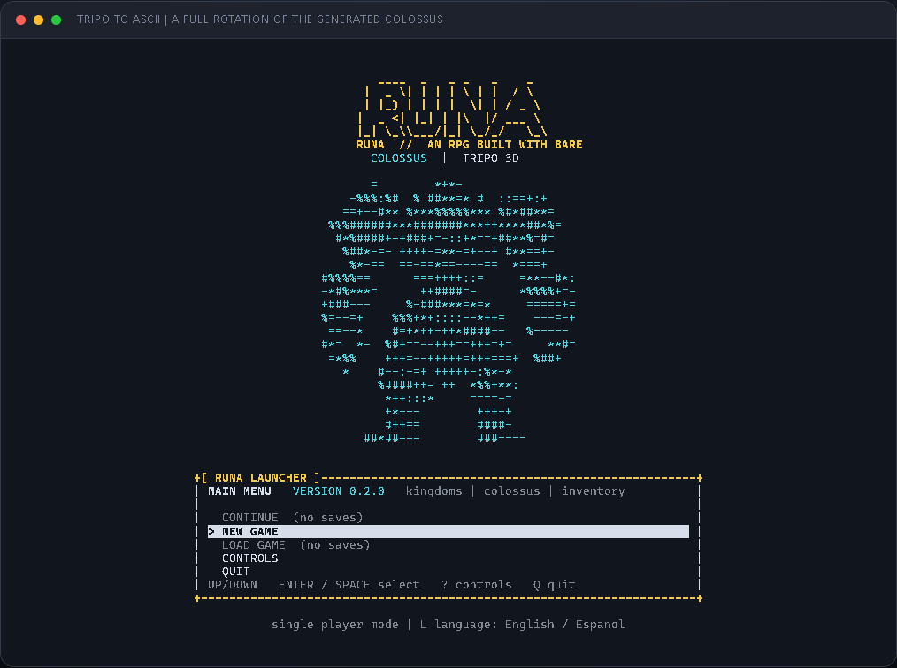

## Actualización para el hackathon de Tripo

[Ver la demo de Tripo en inglés (MP4, 46 segundos)](docs/demo/runa-tripo-focused-en.mp4).
Muestra las integraciones de los modelos generados: el Coloso girando,
el héroe al crear personaje, la compra y el equipamiento del yelmo y una
pelea con el Coloso. Cada escena contiene un modelo de Tripo; el recorrido
general por ciudad y pradera queda fuera de esta demo.

La captura utiliza el render real de Runa y entradas del juego, reproducidos
en un navegador desde una partida de muestra en memoria. El combate está
encuadrado en una terminal de `80×24`, ampliada para ver completo el modelo
`43×13`, los ataques y los cambios de vida. La compra consume oro y los
golpes reducen la vida del jefe. [Cómo se grabó](docs/demo-walkthrough.md).

| Tiempo      | Qué se demuestra                            | Modelo generado |
| ----------- | ------------------------------------------- | --------------- |
| 00:00–00:12 | Una vuelta completa en el menú              | Coloso          |
| 00:12–00:20 | Vista previa y creación de personaje        | Héroe           |
| 00:20–00:28 | Selección y compra por 75 de oro            | Yelmo           |
| 00:28–00:36 | Vista animada y defensa +2 al equiparlo     | Yelmo           |
| 00:36–00:46 | Modelo completo, golpes y avisos de ataques | Coloso          |

RUNA incorpora modelos 3D generados con Tripo **dentro de la terminal**.
Generamos un héroe medieval, un Coloso de piedra, un yelmo de hierro y un paisaje del reino con
texto a 3D, descargamos los GLB y convertimos sus geometrías a cuadros ASCII.
El juego reproduce esos cuadros: no necesita navegador, GPU, API key ni una
conexión a Tripo para mostrarlos. Los cuadros ya están incluidos en el repo.

### Modelos generados e integración

| Modelo generado con Tripo | Integración en RUNA                                                                                             |
| ------------------------- | --------------------------------------------------------------------------------------------------------------- |
| Paisaje del reino         | Modelo experimental disponible en el visor; su geometría resultó poco legible en ASCII y se retiró del menú.    |
| Coloso de piedra          | Gira solo en el menú y aparece en su arena, reutilizando el modelo generado y conservando la lógica de combate. |
| Héroe con espada y escudo | Gira al crear un personaje.                                                                                     |
| Yelmo de hierro           | Gira al seleccionarlo en la armería o en la mochila, cuando hay espacio en la terminal.                         |

Se generaron **cuatro GLB con Tripo** y se integraron **tres modelos** en las
escenas de esta demo. El paisaje permanece como experimento en el visor;
su conversión a ASCII no permitió distinguir bien la forma del reino.

Cada modelo tiene **24 vistas separadas por 15 grados**. Una vuelta tarda
10,8 segundos en el menú; el héroe y el yelmo conservan sus vueltas de tres
segundos. El Coloso va en cian y empieza de frente. Los cuadros del menú existen en `88×22`, `60×10` y `32×5` caracteres y se
elige el mayor que cabe sin ocultar los controles. Maximizar la terminal
permite ver más detalle.

**El Coloso en el menú.** La portada muestra únicamente el Coloso generado
con Tripo. Su silueta empieza de frente y gira lentamente, sin paisaje ni
otras figuras superpuestas.

La captura de portada muestra esta integración en el render del juego.

**Español e inglés.** En el menú principal, `L` alterna el idioma. También
podés iniciar con `npm start -- --lang en` o `--lang es`. La elección se
mantiene durante la sesión; `--lang` permite elegirla en cada lanzamiento.
El catálogo [en.json](lib/locales/en.json) traduce menús, controles,
estadísticas, equipo, diálogos de residentes y mensajes principales.
Los nombres de jugadores, identificadores de objetos, guardados y reglas
de combate conservan sus valores. La demo nueva usa inglés tanto en el
juego como en sus subtítulos de recorrido.

**Creación de personaje.** El héroe generado es una vista previa; el personaje
que camina conserva el sprite compacto, su inicial y el equipo que posee.

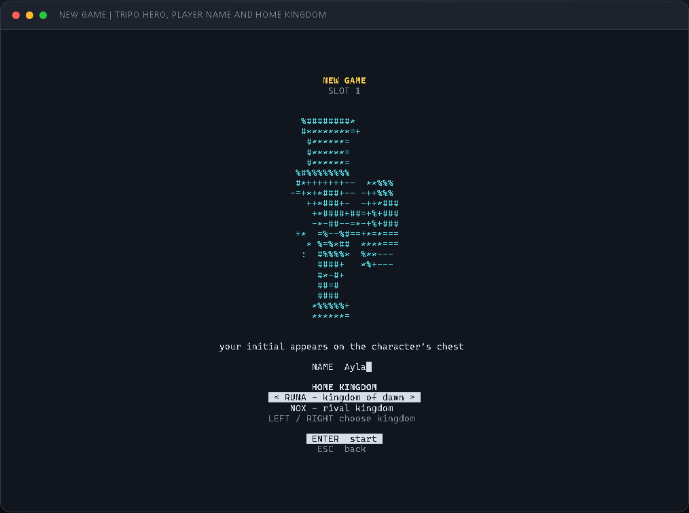

**Yelmo en la armería y en el inventario.** Es la representación del objeto
`iron_helmet` que ya existía: requiere nivel 3, cuesta 75 de oro y aporta
defensa `+2` y velocidad `-0.04`. Se compra con `Enter` en la armería; desde
la mochila (`I`), `Enter` lo equipa y `X` lo quita. La vista previa no cambia
el equilibrio del equipo.

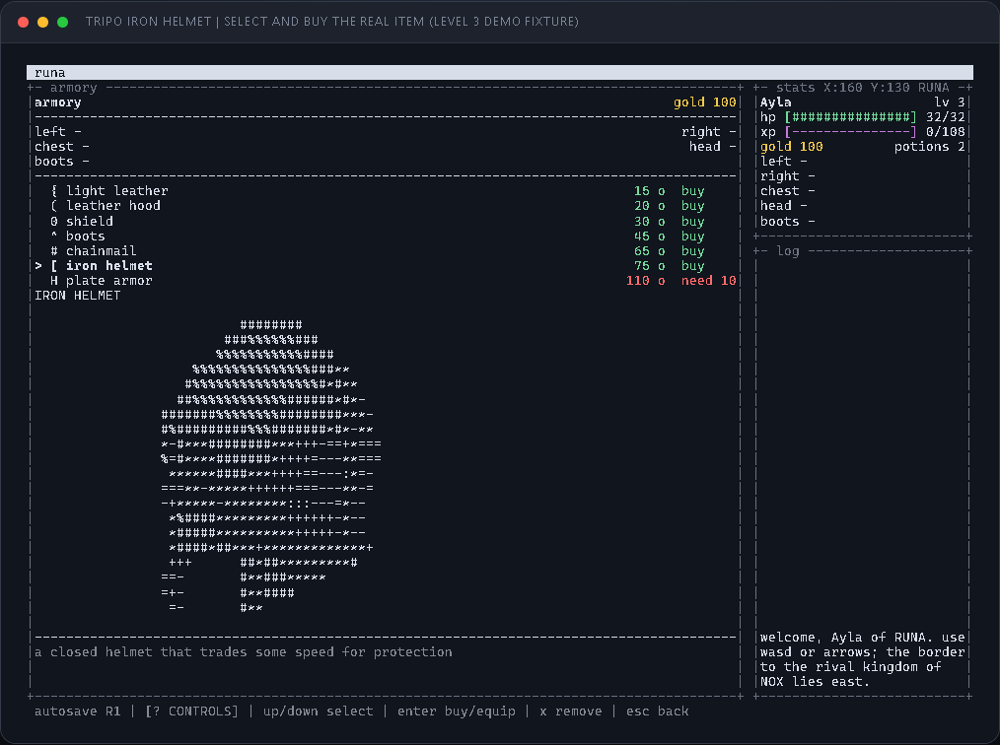

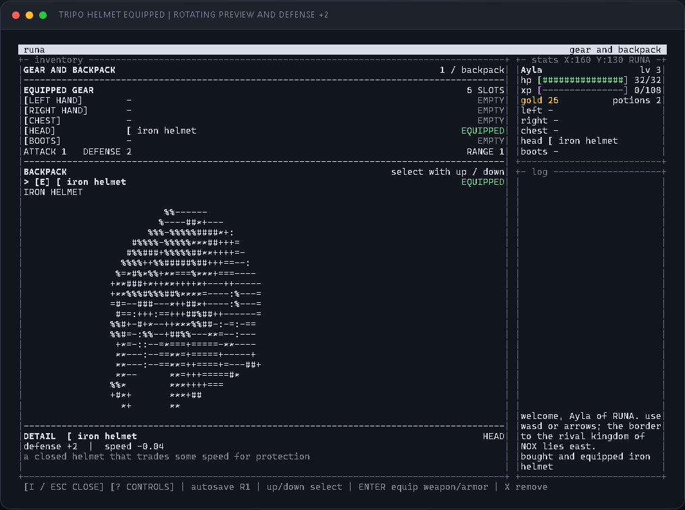

**Coloso en combate, en primer plano.** El mismo GLB del menú se convierte a
un lienzo `43×13` para su arena. Esta captura usa el encuadre real `80×24` de
la demo: se ve el cuerpo completo, el personaje a su lado y la vida del
Coloso en `350/360` después de recibir golpes. El sprite cambia de vista
durante los puñetazos; los avisos, poderes y colisiones pertenecen al juego.

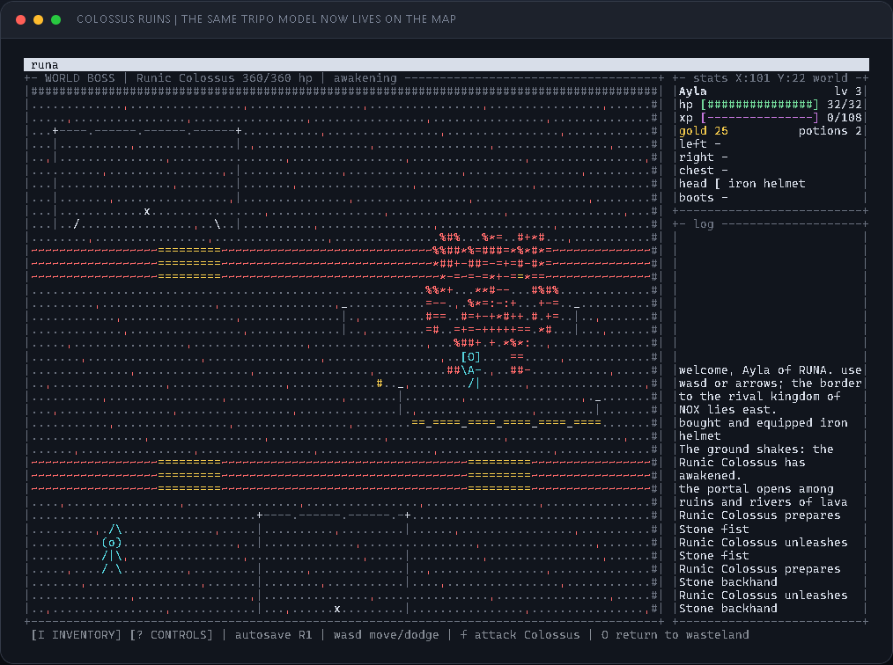

**Los modelos antes de convertirlos a texto.** El visor local es una herramienta
opcional para inspeccionar los GLB originales; el juego funciona sin él.

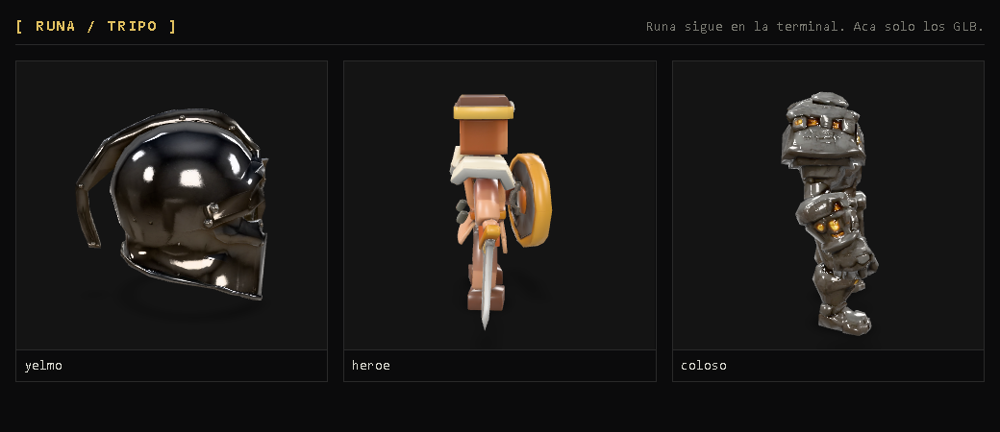

### Cómo lo hicimos

```text
Prompt de texto
  -> Tripo: modelo P1-20260311, 3000 caras, textura y PBR
  -> tarea completada y descarga del GLB
  -> conversión offline: geometría, luz y 24 ángulos
  -> JSON con cuadros ASCII
  -> reloj del juego + bare-tui -> animación en la terminal
```

1. [tripo-generate.js](scripts/tripo-generate.js) crea una tarea en la API v3,
   consulta su progreso y descarga el GLB cuando termina. Usamos
   `P1-20260311`, `face_limit: 3000`, `texture: true` y `pbr: true`. Cada uno
   de estos cuatro pedidos reales consumió 40 créditos según la respuesta de
   la API. Un pedido interrumpido puede retomarse con `--task`, sin crear otro.
2. [glb-to-ascii.py](scripts/glb-to-ascii.py) lee la escena GLB y aplica las
   transformaciones de los nodos. Rota la geometría, proyecta los triángulos
   con un buffer de profundidad y convierte la iluminación de sus superficies
   en caracteres de la escala `.:-=+*#%@`. Compensa la proporción de las
   celdas de terminal, que son más altas que anchas. No muestrea las texturas:
   el ASCII conserva la forma y la luz, con el color aplicado por el juego.
3. [assets/ascii](assets/ascii) contiene las 24 vistas de cada modelo en tres
   tamaños. [render.js](lib/render.js) las muestra y el reloj de
   [game.js](lib/game.js) avanza las vistas: cada 450 ms en el menú y cada
   125 ms aproximadamente en las vistas de personaje y yelmo.
   **Durante el juego solo se carga texto; el procesamiento 3D ocurre antes.**

Los modelos Tripo se usan en el menú, la creación, las vistas del yelmo y el mapa del Coloso.
No hicimos rig ni animación esquelética: el movimiento nuevo es una rotación
de vistas precalculadas.

### Probar la actualización

```bash
npm install
npm start -- --solo
```

Esperá en el menú para ver al Coloso y elegí **Nueva partida** para ver
al héroe. Para inspeccionar el yelmo en detalle, seleccioná la pieza en la
armería o, después de comprarla, en la mochila. No hace falta generar nada
para probar las animaciones incluidas.

Para generar un modelo propio, usá Node 18 o posterior y guardá tu key en
`~/.config/tripo/key.txt` (en Windows, `%USERPROFILE%\.config\tripo\key.txt`)
o en la variable `TRIPO_API_KEY`. La credencial permanece fuera del repo:

```bash
npm run tripo -- --balance
npm run tripo -- --name yelmo "a low-poly iron helmet with a single rune on the brow, game prop"
python3 scripts/glb-to-ascii.py assets/tripo/yelmo.glb --output assets/ascii/yelmo.json
```

La conversión requiere Python 3 y `numpy`. En Ubuntu, podés preparar un entorno
fuera del repositorio:

```bash
python3 -m venv ~/.venvs/runa-ascii
source ~/.venvs/runa-ascii/bin/activate
python3 -m pip install numpy
```

Activá ese entorno antes de ejecutar el conversor. Los GLB se guardan en
`assets/tripo/`, fuera de git. Los JSON se versionan para que cualquier persona
pueda jugar sin credenciales. Para ver los GLB originales:

```bash
node scripts/tripo-viewer.js --fetch-lib
npm run tripo:viewer
```

Abrí `http://127.0.0.1:4173/`. El visor detecta modelos nuevos automáticamente.
En esta máquina usamos `node --use-system-ca scripts/tripo-generate.js ...`
con Node 24 para que HTTPS reconozca los certificados del sistema.

Los prompts utilizados, el flujo de regeneración y las
limitaciones están documentados en [ascii-turntable.md](docs/ascii-turntable.md)
y [tripo-integration.md](docs/tripo-integration.md).

### Portada ilustrada

También creamos una portada gráfica con una herramienta de generación de
imágenes independiente de Tripo. Se conserva como material visual del proyecto;
la pantalla del juego utiliza ASCII.

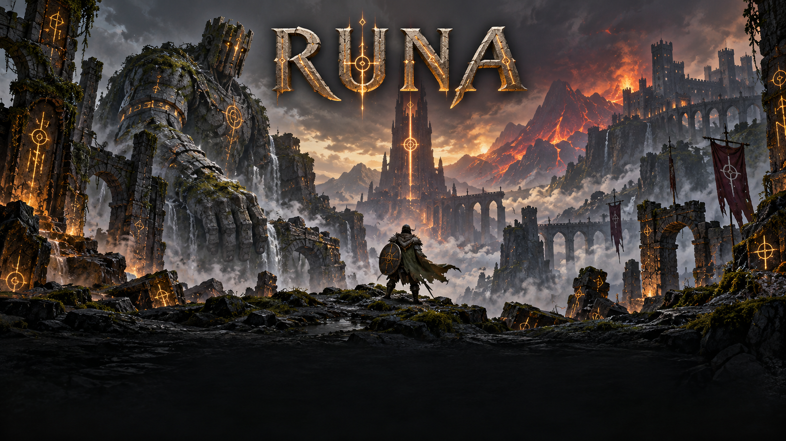

## Novedades de la versión 0.2.0

- El mundo ahora une los reinos rivales de RUNA y NOX mediante portones completos en los extremos de la pradera; el reino natal se elige al crear el personaje.
- NOX fue reconstruido desde cero como una capital exterior de `320x200`, con la misma modalidad urbana de RUNA: avenidas, manzanas, plaza, jardines y edificios orientados hacia la calle.
- La nueva cripta tiene tres niveles consecutivos, escaleras ASCII, slimes, cuatro clases de esqueletos y un Rey Esqueleto final.
- El Coloso Rúnico fue reubicado en un mapa independiente de ruinas volcánicas, lava y puentes, al que se entra por un portal monumental del yermo.
- El inventario incorpora mano izquierda, mano derecha, pecho, casco y botas. Armas, escudo y armaduras pueden equiparse simultáneamente y guardarse en el cofre del hogar.
- La plaza suma estatua con rankings de nivel y PvP, caballero de misiones, fuente animada y controles desplegables.
- El combate conserva el arma elegida —lanza, arco, ballesta, daga o martillo— y la ficha muestra coordenadas `X/Y` para ubicar cualquier punto del mundo.

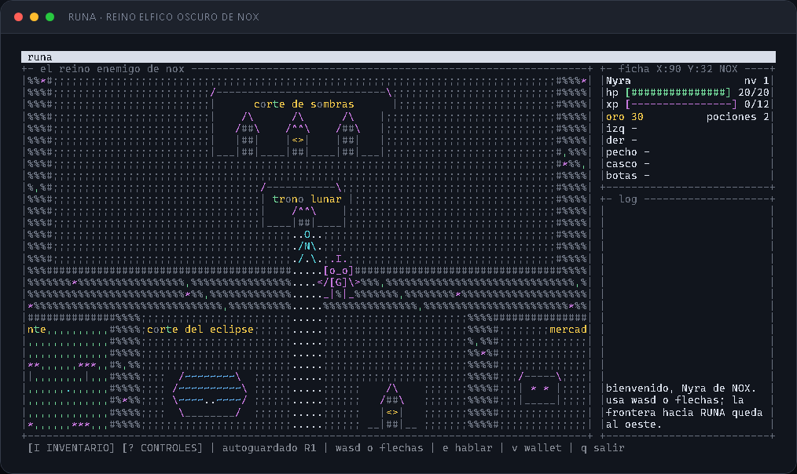

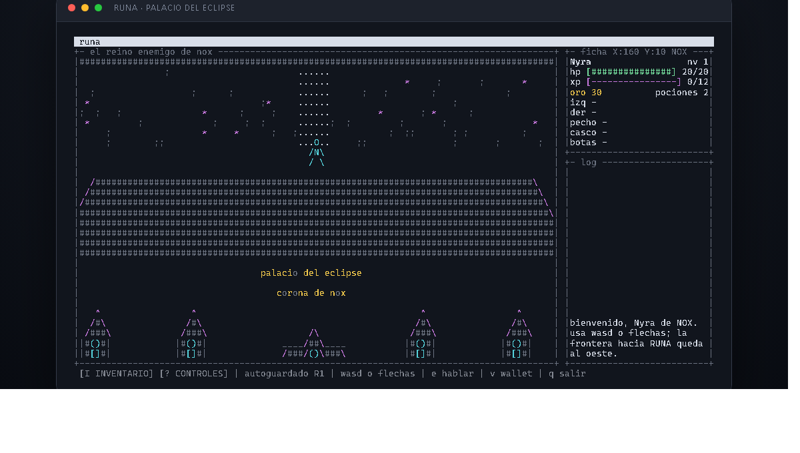

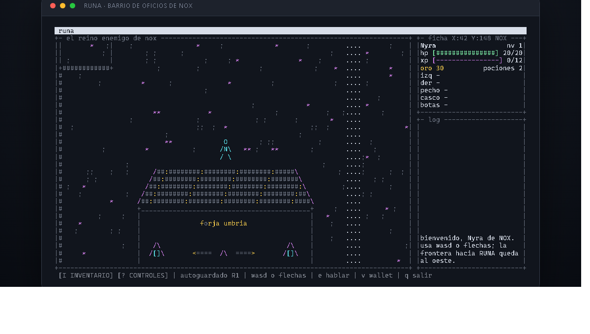

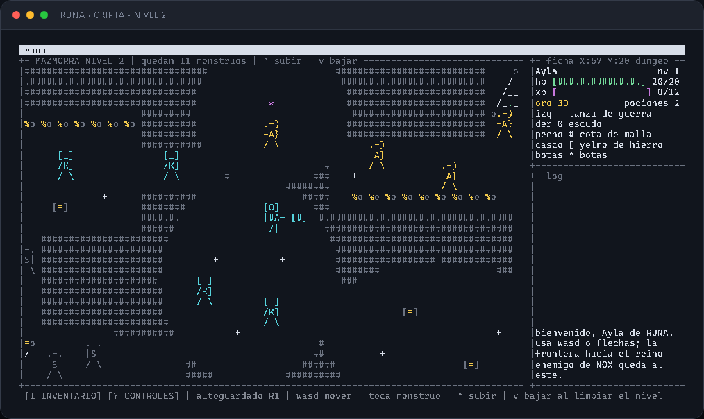

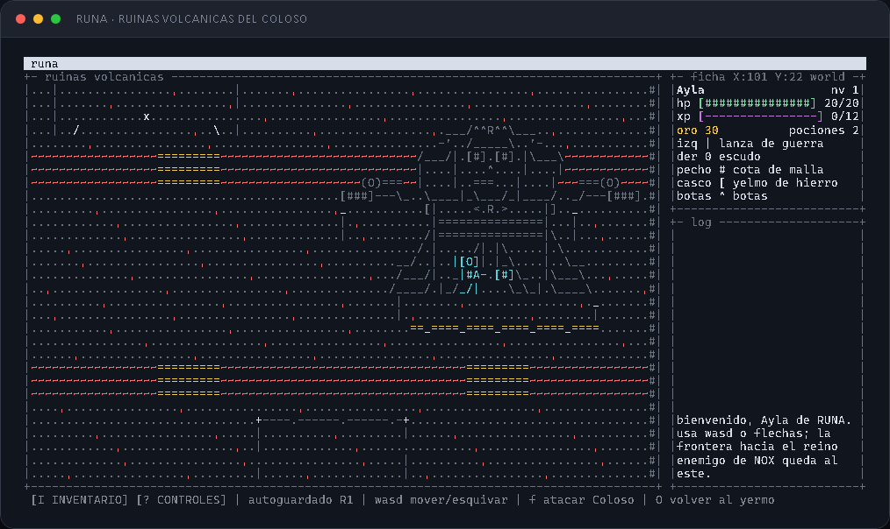

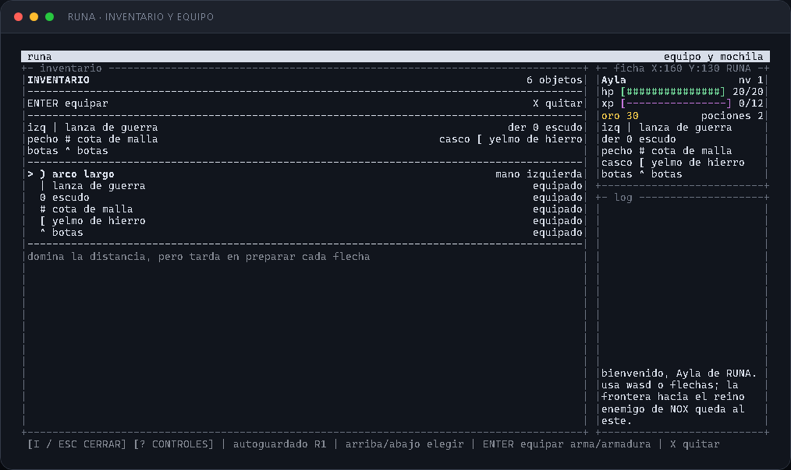

## Características actuales

- Ciudad de `320x200` caracteres con barrios, iglesia, taberna, herrería, armería y un castillo explorable.
- Dos reinos rivales, RUNA y NOX, con elección de origen y portones monumentales en extremos opuestos de la pradera.
- Salón del trono con rey, mobiliario real y una escalera propia hacia las ruinas.
- Portón funcional que transporta al jugador a la pradera.
- Pradera de `260x72` con tres asentamientos bárbaros, una cripta de tres niveles, escalinatas ASCII monumentales y un portal al world boss.
- Arena volcánica independiente con lava, ruinas y el Coloso Rúnico.
- NPC con arte y oficios diferenciados.
- Monstruos que patrullan el mapa sin detener el movimiento del mundo.
- Combate sobre la propia pradera, sin cambiar a una pantalla separada.
- Nueva partida con nombre personalizado e inicial visible en el pecho del héroe.
- Tres ranuras persistentes con carga y autoguardado de progreso.
- Botón permanente `[I INVENTARIO]`, depósito en el hogar y cinco ranuras de equipo independientes.
- Botón `[? CONTROLES]` y ayuda desplegable disponible desde el menú o la partida.
- Estrategias de combate escritas en `script.txt` y recargadas mientras juegas.
- Presencia opcional entre jugadores mediante Hyperswarm.
- Estatua de los héroes en la plaza con rankings por nivel y resultados PvP.
- Caballero de misiones en la plaza con objetivos persistentes y recompensas.

## Nueva partida y personaje

El menú principal separa claramente `Continuar`, `Nueva partida`, `Cargar partida` y `Salir`. `Continuar` abre la partida más reciente; `Nueva partida` usa la primera ranura vacía y `Cargar partida` abre el selector de tres ranuras. Si las tres están ocupadas, `N` permite elegir cuál reemplazar y la pantalla de nombre avisa qué personaje será sustituido.

La creación permite elegir con izquierda/derecha si el personaje nace en RUNA o en el reino enemigo de NOX. Cada origen tiene su propio punto de inicio y templo de reaparición. La frontera oriental de RUNA conecta con la frontera occidental de NOX, y se puede cruzar caminando en ambos sentidos.

NOX fue rehecho desde cero como una capital exterior de `320x200`, igualando la modalidad del reino original sin copiar su decoración. Una avenida central, tres calles transversales y callejones laterales conectan el Palacio del Eclipse, el paseo lunar, el mercado nocturno, la plaza del eclipse, dos jardines y seis edificios de servicio. Las fachadas de `31x21` a `45x24` tienen la misma escala urbana legible de RUNA; el palacio de `96x42` domina el norte sin convertirse en un mapa interior. Santuario, hogar, posada, alquimia, forja y armería conservan puertas funcionales y arte oscuro propio. Seis habitantes explican la cultura y servicios del reino. Las decisiones visuales y sus [fuentes de inspiración están documentadas](docs/nox-design.md).

El juego autoguarda después de cada acción y al salir. Conserva nombre, reino natal, nivel, vida, oro, experiencia, pociones, inventario, equipo, depósito del hogar y posición en la ciudad, NOX, el castillo, las ruinas, la pradera, la cripta o la arena volcánica. También conserva el progreso de la mazmorra y la vida del world boss. La ranura activa aparece en el pie de la pantalla como `autoguardado R1`, `R2` o `R3`.

La primera letra alfanumérica se convierte en el emblema del pecho. Por ejemplo, **Ayla** aparece como `A`:

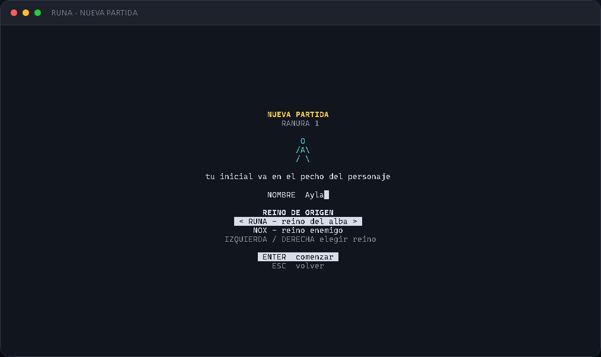

El personaje comienza sin armas ni escudo. Su dibujo cambia únicamente cuando equipa un objeto real:

```text
sin equipo       espada          espada + escudo

    O            / O             / O
   /A\           /|A\            /|A\ [#]
   / \            / \             / \
```

## La ciudad

RUNA usa una cámara desplazable sobre una capital de `320x200`, pero sus edificios civiles tienen ahora una escala media de calle: entre `31x21` y `45x24` celdas. El castillo conserva la silueta dominante sin cubrir el distrito completo. La avenida de la corona une castillo, mercado del alba, plaza de los héroes y gran portón; calles transversales y callejones conectan iglesia, hogar, taberna, alquimia y barrio de oficios.

Cada fachada mantiene identidad propia sin parecer una fortaleza: campanario y rosetón para la iglesia, entramado y jarra colgante para la taberna, fragua abierta para la herrería y bastidores defensivos para la armería. El suelo caminable se renderiza limpio y solo conserva una textura dispersa —aproximadamente `5%` de las celdas— para que edificios, monumentos y NPC no compitan contra un fondo de puntuación continua. Los jardines del alba y de la corona, el pregonero, la panadera, el cartógrafo, la herbolaria, el farolero, el escriba y la aprendiz hacen que RUNA funcione como capital habitada. La investigación y sus decisiones están documentadas en [docs/runa-design.md](docs/runa-design.md).

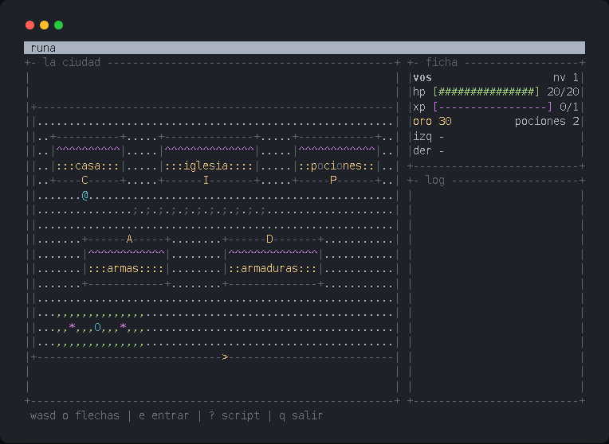

Las puertas se activan al pisarlas. El gran portón del sur conecta con la pradera y la puerta principal del castillo abre el salón del trono. Dentro espera el rey Aldren sentado en su trono, rodeado por una tarima real, columnas, estandartes, bancos y braseros. La escalera lateral `V` baja desde allí a las ruinas.

## La pradera

La pradera ahora mide `260x72` y combina caminos, parcelas, setos, surcos, claros boscosos y zonas de distinta dificultad. Su textura de suelo es deliberadamente tenue y espaciada para que edificios, criaturas y entradas sean fáciles de leer; los caminos conservan el contraste principal. El camino real une los portones de RUNA y NOX y un cruce señalizado abre ramales hacia la cripta y el portal. Eira, guardabosques del camino, explica esas rutas al hablarle con `E`. Mosquitos, espectros y gólems tienen sprites compactos y se mueven por su cuenta sin invadir puestos, monumentos ni campamentos. El borde oeste contiene el portón completo de RUNA, cuyo paso `<` vuelve a la ciudad; en la punta opuesta, contra el borde este, el portón oscuro `N` entra al reino de NOX. Lejos de esa frontera, la entrada `X` abre una cripta de tres niveles y el portal `O` lleva a las ruinas volcánicas del Coloso Rúnico.

Tres empalizadas bárbaras aparecen en sectores separados de la pradera. La puerta `J` abre un mapa interior con casa del caudillo, tiendas, almacenes, corral, forja, fogata y patrullas de saqueadores, lanzadores y un jefe. Se puede abandonar por `U`, pero el asentamiento permanece si quedan enemigos. Al derrotarlos a todos y salir, se cobra un botín adicional de `45`, `70` o `100` monedas y la entrada desaparece permanentemente. La estructura y sus [referencias arqueológicas están documentadas](docs/barbarian-settlements.md).

La ficha muestra siempre la posición actual como `X:n Y:n` junto al mapa o zona. Las coordenadas cambian con cada paso y distinguen RUNA, NOX, castillo, ruinas, coliseo, pradera, yermo, cada nivel del dungeon y el mapa del world boss. Podés usar esa referencia para señalar un lugar concreto al reportar un problema o pedir un cambio.

La arena del world boss es un mapa independiente de ceniza, edificios destruidos y ríos de lava. La lava bloquea el paso: hay que cruzar por los puentes de piedra y conservar espacio para esquivar los poderes del Coloso. El mismo portal `O` permite volver al yermo.

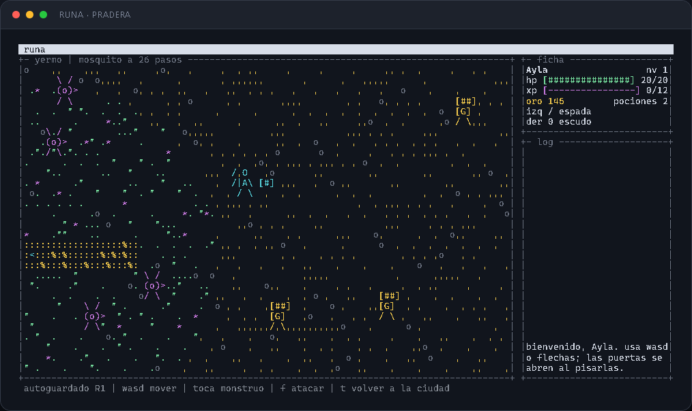

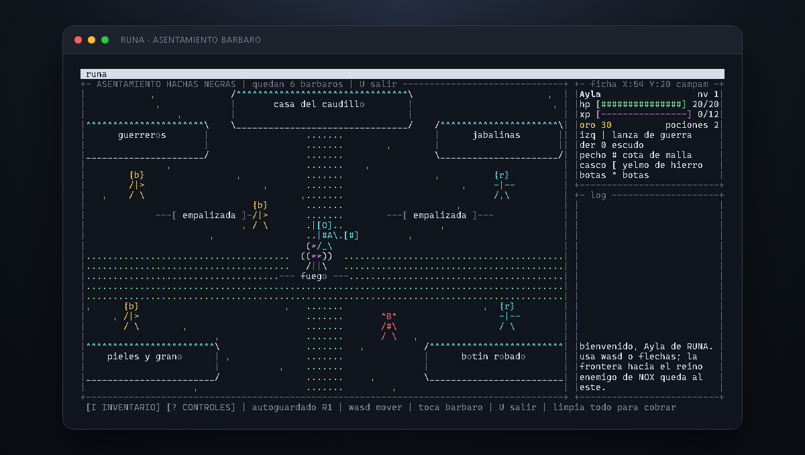

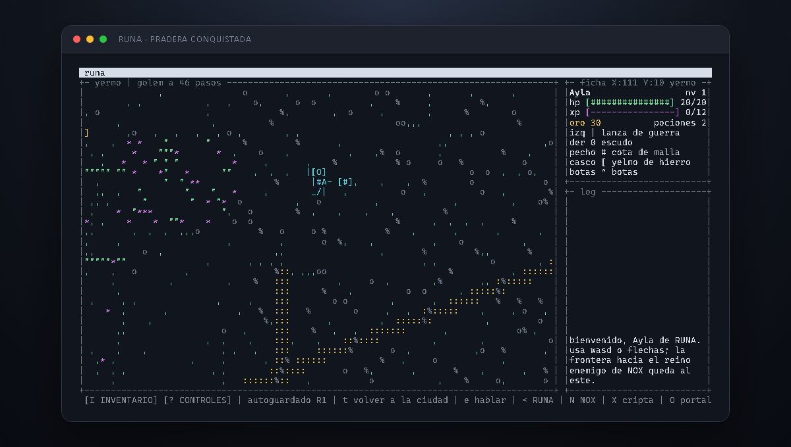

Los espacios internos de todos los sprites son transparentes: el pasto y los caminos siguen visibles entre brazos, piernas y equipo.

Sir Cedric espera junto a la estatua de la plaza. Al hablarle con `E` entrega la misión de eliminar `20` mosquitos. Cada baja real actualiza el contador de la ficha y, al regresar con el objetivo completo, concede `100` de oro y `100` de experiencia. La recompensa solo puede cobrarse una vez y el progreso se conserva en la ranura activa.

## Combate dentro del mapa

El combate empieza cuando la hitbox del jugador toca la de un monstruo. Los dos personajes permanecen visibles sobre el terreno.

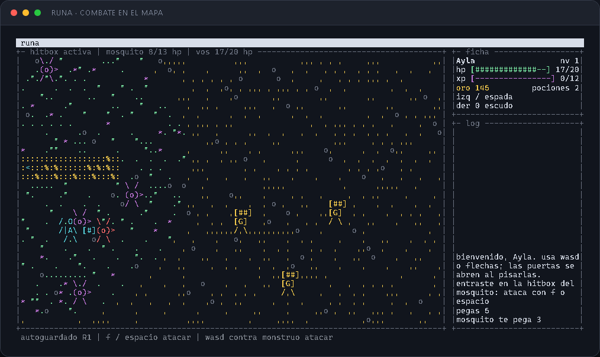

Cada pulsación de `F`, `Espacio` o una dirección contra el enemigo resuelve un intercambio. El arma elegida en `I INVENTARIO` permanece en la mano durante el combate: lanza, arco, ballesta, daga y martillo conservan su daño, alcance, velocidad y dibujo propios al golpear. La tecla solamente hace avanzar el turno visible.

El archivo `script.txt` se vuelve a leer durante el combate:

```text
?hp < 8
 use potion
```

La estrategia inicial no cambia armas por su cuenta. Si querés una estrategia que alterne equipo durante la pelea, podés añadir reglas `equip`, pero solo se aplican a objetos que el jugador realmente posee; una orden inválida nunca reemplaza el arma equipada desde el inventario.

## Armas, armaduras y tiendas

Inventario y equipo no son lo mismo. Podés llevar simultáneamente un arma en la mano izquierda, un escudo en la derecha, armadura de pecho, casco y botas. Comprar un objeto lo añade a la mochila y lo equipa automáticamente en su ranura sin quitar objetos de las otras cuatro:

| Ranura         | Objetos                                             | Efecto                               |
| -------------- | --------------------------------------------------- | ------------------------------------ |
| Mano izquierda | daga, espada, lanza, ballesta, martillo, arco largo | Ataque, alcance y velocidad de golpe |
| Mano derecha   | escudo                                              | Defensa sin quitar el arma           |
| Pecho          | cuero, cota de malla, placas                        | Defensa y movilidad                  |
| Casco          | capucha de cuero, yelmo de hierro                   | Defensa de la cabeza                 |
| Botas          | botas                                               | Velocidad de movimiento              |

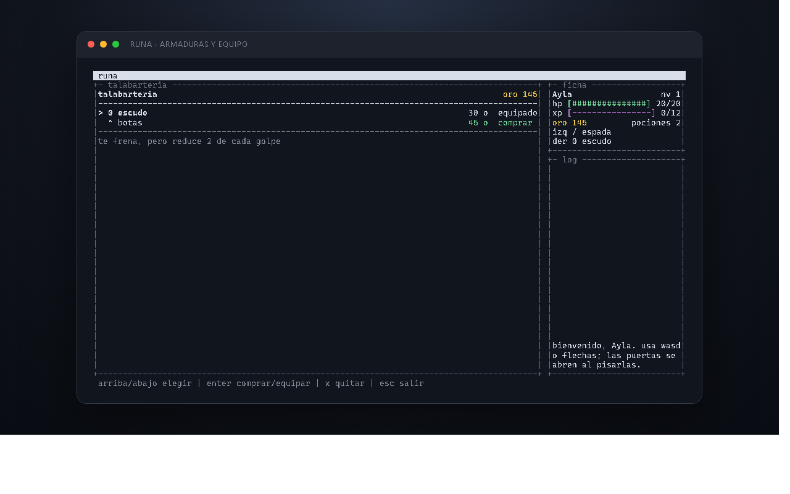

En una tienda:

- `Enter` compra o equipa el objeto seleccionado.
- `X` lo quita sin venderlo ni eliminarlo del inventario.
- `Esc` o `E` vuelve a la ciudad.

El escudo solo aparece junto al personaje cuando está equipado y reduce en `2` el daño de cada golpe, con un daño mínimo de `1`.

El botón `[I INVENTARIO]` permanece visible en ciudad, pradera, dungeon y world boss. La tecla `I` abre una pantalla separada de equipo y mochila: muestra las cinco ranuras activas, ataque, defensa y alcance combinados, marca cada pieza equipada y detalla los atributos del objeto seleccionado. `Enter` equipa el arma o armadura seleccionada y `X` la quita. Al interactuar con `C`, el hogar abre un cofre personal: izquierda/derecha cambia entre mochila y depósito, y `Enter` deposita o retira. Depositar una pieza equipada la quita de su ranura de forma segura; el objeto y el contenido del cofre persisten en el autoguardado.

La daga y el cuero liviano cuestan `15` de oro cada uno, así que una partida nueva puede probar inmediatamente arma y pecho con sus `30` de oro iniciales. Las piezas posteriores intercambian alcance, daño, defensa y velocidad; no son mejoras lineales.

## Controles

El botón `CONTROLES` del menú principal y el botón `[? CONTROLES]` del pie abren
la misma lista de ayuda. También puede abrirse directamente con `?`; `Esc`, `?`
o `Enter` la cierran y devuelven a la pantalla anterior.

| Contexto         | Teclas                        | Acción                               |
| ---------------- | ----------------------------- | ------------------------------------ |
| Menú principal   | flechas / `W` / `S`           | Elegir una opción                    |
| Menú principal   | `Enter` / `Espacio`           | Aceptar la opción                    |
| Menú principal   | `N`                           | Comenzar una partida nueva           |
| Ranuras          | flechas / `W` / `S`           | Elegir una ranura                    |
| Ranuras          | `Enter`, `N`, `Esc`           | Cargar, reemplazar o volver          |
| Nombre y reino   | escribir, ←/→, `Enter`, `Esc` | Editar, elegir origen o volver       |
| Ciudad y pradera | `WASD` / flechas              | Moverse                              |
| Mundo            | `E` / `Enter` / `Espacio`     | Hablar o interactuar                 |
| Pradera          | `E` cerca de Eira             | Consultar las rutas del camino real  |
| Jugador cercano  | `E`                           | Enviar un desafío PvP                |
| Estatua central  | `E`                           | Abrir rankings de nivel y PvP        |
| Rankings         | izquierda/derecha / `Tab`     | Cambiar clasificación                |
| Invitación PvP   | `Enter` / `N`                 | Aceptar o rechazar                   |
| Coliseo PvP      | `WASD`, `F`, `R`              | Moverse, atacar o rendirse           |
| Ciudad           | `V`                           | Abrir Wallet y PvP                   |
| Wallet           | `A` / `Enter`, `X`, `Esc`     | Vincular, desvincular o volver       |
| Pradera          | `T`                           | Volver a la ciudad fuera de combate  |
| Bordes pradera   | caminar sobre `<` / `N`       | Entrar a RUNA o al reino de NOX      |
| Asentamientos    | caminar sobre `J` / `U`       | Entrar o salir del campamento        |
| Combate          | `F` / `Espacio` / `Enter`     | Resolver un intercambio              |
| Tienda           | flechas, `Enter`, `X`, `Esc`  | Elegir, equipar, quitar o salir      |
| Inventario       | `I`, flechas, `Enter`, `X`    | Abrir, elegir, equipar o quitar      |
| Hogar `C`        | `E`, ←/→, `Enter`, `X`, `Esc` | Depositar, retirar o equipar         |
| Juego            | `R`                           | Recargar `script.txt`                |
| Juego            | `?`                           | Abrir o cerrar la lista de controles |
| Juego            | `Q` / `Ctrl+C`                | Salir                                |

La terminal mínima es de **64x16**. Para apreciar el mapa y la ficha lateral se recomienda **120x34** o más.

La pantalla de wallet acepta únicamente una dirección pública Stellar `G...` y
la guarda con la ranura. No acepta ni almacena seeds secretas `S...`. Vincular
una dirección identifica al jugador, pero las apuestas on-chain seguirán
marcadas como pendientes hasta configurar el contrato desplegado y un firmante
externo. Consulta [docs/wallet.md](docs/wallet.md).

## Ejecutar desde el repositorio

Requiere Node.js y npm para instalar las dependencias. El juego se ejecuta con el runtime Bare incluido en el proyecto.

```bash
git clone https://github.com/Bitcoindefi/runa.git
cd runa
npm install
npm start -- --solo
```

Para habilitar la presencia entre jugadores, inicia sin `--solo`:

```bash
npm start
```

También puedes elegir un nombre inicial desde la línea de comandos; aparecerá precargado en la pantalla de nueva partida:

```bash
npm start -- --solo --name Ayla
```

## Pruebas y revisión

```bash
npm test
npm run lint
npx bare test/map.smoke.js
```

Estado revisado de esta versión:

- `143/143` pruebas correctas.
- `1360/1360` aserciones correctas.
- Formato y lint limpios.
- RUNA, NOX, fronteras, puertas, portón, pradera y dungeon validados por el smoke test.
- Capturas inspeccionadas y recortadas al borde exacto de la terminal.

## Capturas reproducibles

Las imágenes de este README no son maquetas escritas a mano. El script [scripts/readme-screens.js](scripts/readme-screens.js) construye cada estado usando `Runa`, `Field`, `Dungeon`, `BossZone` y el render real del juego, y genera HTML con los colores ANSI listo para capturar.

```bash
npx bare scripts/readme-screens.js .readme-screens
```

Esto evita documentar una ciudad, un héroe o un combate que ya no coincidan con el código.

Las cinco capturas de la demo Tripo se obtienen de los cuadros de
[demo-walkthrough.js](scripts/demo-walkthrough.js): menú, personaje,
tienda e inventario en `120×44`, y pelea en `80×24`. Se captura el elemento
`.terminal` con un viewport suficiente para mostrarlo entero. Los mismos
cuadros se reproducen en el video. `tripo-modelos.png` muestra los cuatro
GLB originales en el visor local. El nivel, el oro y la espada del combate
son datos preparados para demostrar la integración; la compra y los
golpes se ejecutan con las entradas reales del juego.

## Arquitectura

| Archivo                        | Responsabilidad                                       |
| ------------------------------ | ----------------------------------------------------- |
| `lib/game.js`                  | Menús, entrada, transiciones y coordinación general   |
| `lib/map.js`                   | Ciudad, castillo, colisiones, puertas y NPC           |
| `lib/field.js`                 | Pradera, cámara, patrullaje y encuentros              |
| `lib/dungeon.js`               | Tres niveles de mazmorra, rutas y encuentros          |
| `lib/boss-zone.js`             | Ruinas volcánicas y combate del world boss            |
| `lib/world.js`                 | Simulación de combate y estadísticas derivadas        |
| `lib/shop.js`                  | Economía, inventario, equipo, guardados y migraciones |
| `lib/saves.js`                 | Tres ranuras, archivos persistentes y carga segura    |
| `lib/render.js`                | Composición estable de cada cuadro de terminal        |
| `lib/sprites.js`               | Arte ASCII del héroe, NPC y referencias maestras      |
| `lib/synchronized-renderer.js` | Publicación atómica de cuadros en Windows Terminal    |

Los enemigos, objetos, tiendas y mapas son datos. Esto permite ampliar el contenido sin duplicar lógica de combate o de renderizado.

## Bare, Pear y distribución P2P

- **Bare** ejecuta el juego y sus pruebas sin depender de las APIs internas de Node.
- **bare-tui** proporciona el ciclo de actualización, teclado y render de terminal.
- **Pear** permite distribuir builds y actualizaciones entre pares.
- **Hyperswarm** ofrece presencia opcional sin convertir el estado del jugador en una dependencia de red.

La partida funciona completamente en modo solitario cuando la red no está disponible.

## Referencias de arte ASCII

Los diseños compactos fueron adaptados a la escala del mapa a partir de referencias ASCII clásicas. El caballero maestro conserva la firma `hjw` en el código.

- [Colección de caballeros ASCII](https://ascii.genocation.com/ascii/caballeros.html)
- [Colección general de arte ASCII](https://ascii.genocation.com/ascii/coleccion.html)

El interior de la cripta parte de fuentes arquitectónicas y criterios de
exploración documentados en [docs/dungeon-design.md](docs/dungeon-design.md).

## Licencia

Apache-2.0.
